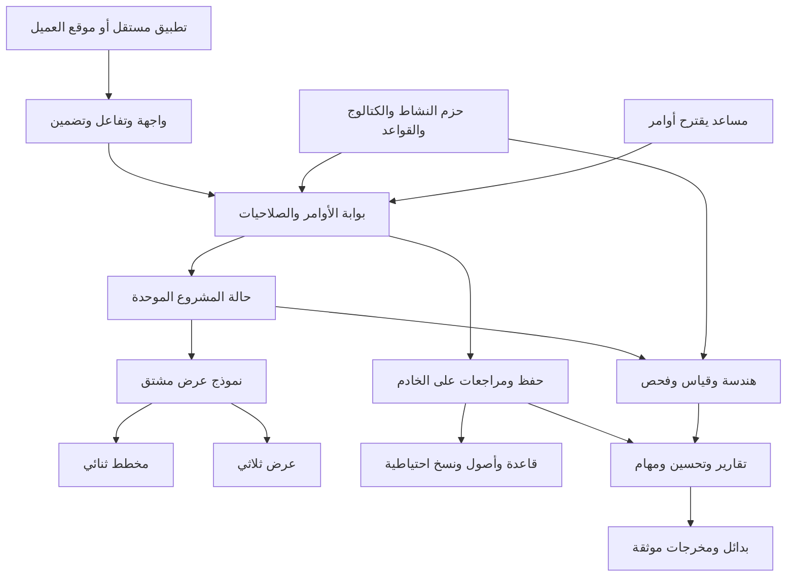

# 🧭 الخطة الرئيسية لمنصة تخطيط المساحات

**وثيقة منتج ومعمارية وتنفيذ — الإصدار الأول — ٢٥ سبتمبر ٢٠٢٦**

مُعدّة بناءً على ملف المتطلبات المرفق. هذه خطة قبل البرمجة، وليست وصفًا لبرنامج تم تنفيذه أو اختباره. القرارات والتقديرات التالية مقترحات تصميمية؛ المصادر الرسمية تثبت قدرات الأدوات، ولا تثبت نجاح المنتج تجاريًا. أرقام الأداء والمدة والتسعير المستهدف فرضيات تُختبر، وليست وعودًا.

> ### 🔄 تحديث ٢٥ سبتمبر ٢٠٢٦ — تغيير الأولويات (الخطة الأصلية تحت زي ما هي)
>
> **إيه اللي اتغيّر:** الأولوية التجارية بقت للقطاع الصناعي. الترتيب الجديد بعد القاعات والمكاتب (خلصوا):
> ت٥ أساس صناعي مشترك ← ت٦ تحميل الحاويات ← ت٧ المخازن ← ت٨ خطوط الإنتاج ← ت٩ جراجات ومواقف الأتوبيسات والعربيات ← ت١٠ المطاعم ← ت١١ الحسابات والشركات والعمل الجماعي.
>
> **ليه:** مفيش أي حزمة صناعية محتاجة الحسابات عشان تشتغل، وإثبات المحرك على أصعب الحالات الأول بيخلي تصميم المنصة متعددة المستخدمين مبني على حاجات موجودة فعلًا.
>
> **إيه اللي لسه صالح:** كل قواعد النواة، ومسار الأوامر الواحد للناس والوكلاء، والرؤية والأسواق، وفصول تعدد الشركات والتضمين (بقت ت١١ وبعدها).
>
> **اتأخر إيه:** الخادم المشترك والحسابات (كانت ت٥ وبقت ت١١). مرحلة «المكاتب ثم المخازن» (القسم ٣٥ المرحلة الخامسة) اتقسمت: المكاتب خلصت، والمخازن بقت ت٧ بتفاصيل أوسع.
>
> التفاصيل الكاملة والأبحاث والتراخيص في [`03-industrial-packs-plan.md`](03-industrial-packs-plan.md).

لصاحب المشروع: اقرأ أول أربعة أقسام، ثم الأقسام ٣٤ و٤٣ و٤٤ و٥٠. للمطور: الوثيقة كلها عقد تأسيسي، خصوصًا الوحدات والهندسة والأوامر والحفظ. أسماء الملفات والعقود التقنية مكتوبة منفصلة عن الشرح العربي لتسهيل تسليمها لأي فريق.

## 1. الرؤية التنفيذية 🎯

نبني **منصة تساعد العميل يجرّب ترتيب المكان، ويعرف هل الأشياء هتدخل وتشتغل فيه، قبل ما يصرف على التنفيذ**. القيمة ليست صورة جميلة فقط؛ القيمة تقليل أخطاء المقاسات، وتسريع عرض البدائل، وتوضيح أثر كل ترتيب على السعة والتكلفة والحركة.

**القرار:** أساس واحد، وحزم أنشطة تُركّب عليه، وإصدارات تجارية تُنتج من إعدادات معلنة. أول سوق مقترح هو تجهيز قاعات المناسبات، مع حزمة مكاتب صغيرة لاختبار إعادة الاستخدام، ثم المخازن.

**البديل:** البدء بالمخازن بسبب خبرتك في المصنع وقربك من المستخدمين. يصبح أفضل إذا وُجد عميل محدد ببيانات جاهزة وتجربة مدفوعة؛ بشرط أن يكون النطاق ترتيب أرفف وممرات، لا تصميمًا إنشائيًا أو اعتمادًا للسلامة.

**السبب:** القاعات تختبر السحب والمقاسات والكراسي والأبواب والتقارير بسرعة، والمكاتب تكشف هل المنصة عامة فعلًا. المخازن تضيف قيمة أعلى، لكنها تحتاج بيانات وتشغيلًا وتحققًا أكثر.

**الخطر:** بناء ثمانية منتجات قبل إثبات أن عميلًا واحدًا سيدفع. نعالجه ببيع نتيجة واحدة واضحة: «اعرض ترتيبين قابلين للمراجعة في وقت قصير، مع أبعاد وقائمة عناصر وملاحظات».

## 2. تعريف المنتج 📐

منتج تخطيط مكاني يعمل أساسًا في المتصفح. المشروع يحتوي مكانًا مقاسًا، وعناصر بأبعاد حقيقية، وترتيبات بديلة، وقواعد معلومة المصدر، ومخرجات مراجعة. الرسم العلوي هو مساحة العمل الأساسية، والمشهد المجسم وسيلة فهم وعرض لنفس البيانات.

أربع طبقات للقيمة: **ارسم → رتّب → افحص → قرّر**. «احفظ واعرض وصدّر» وظائف تدعم الرحلة كلها. أي تحسين آلي يقترح بديلًا، والمستخدم يختار اعتماده.

نعرّف مستويات الثقة بوضوح: أبعاد أدخلها المستخدم؛ أبعاد من مورد؛ أبعاد قيسَت ميدانيًا؛ أبعاد مُستنتجة من صورة. اختلاف المصدر يغيّر الثقة، ولا تغيّر الصورة المجسمة هذه الحقيقة. لكل مشروع تاريخ مراجعة للأبعاد والمسؤول عنها.

مؤشر النجاح الأساسي: نسبة المستخدمين الذين ينجزون **ترتيبًا مفحوصًا ومصدّرًا**. نقيس أيضًا زمن أول تصميم، وزمن تعديل طلب عميل، وعدد الأخطاء المكتشفة قبل التنفيذ، والتحول من تجربة إلى اشتراك.

## 3. ما الذي لن يصبحه المنتج 🚧

ليس بديلًا للرسم الهندسي المتخصص، أو نمذجة معلومات المباني، أو حساب الأحمال، أو اعتماد مخارج الطوارئ. لا يضمن أن أرفف المخزن تتحمل وزنًا معينًا؛ يسجل بيانات الشركة المصنّعة ويقارنها بشروط معلومة.

لا يتحول إلى نظام حسابات أو مشتريات أو مخزون تشغيلي. يعرض الكميات والتكلفة التقديرية ويتكامل مع نظام العميل. لا يقدم محاكاة ميكانيكية، ولا يتعامل في البداية مع أنابيب ثلاثية الأبعاد معقدة أو جدران منحنية حرة.

اختبار مرور داخل التصميم لا يثبت إمكان إدخال الجهاز من بوابة المصنع؛ **مسار إدخال وتجميع المعدة** قدرة لاحقة مستقلة. والسعة المكانية للماكينات لا تساوي السعة الإنتاجية؛ الأخيرة تحتاج أزمنة دورات وورديات واختناقات.

نتائج السلامة تُسمى «مراجعة وفق القواعد المحددة». لا نستخدم عبارة «معتمد هندسيًا» إلا بوجود مسار اعتماد مهني خارجي مستقل.

## 4. المستخدمون والأسواق المستهدفة 👥

| السوق | المشتري | سبب الدفع | صعوبة البداية | قرار الدخول |
|---|---|---|---|---|
| قاعات وتجهيز مناسبات | مالك القاعة أو شركة التجهيز | تجهيز عرض أسرع وتقليل إعادة الترتيب | منخفضة إلى متوسطة | البداية المقترحة |
| مورّدو أثاث المكاتب | المبيعات والتصميم | تحويل قائمة المنتجات إلى عرض مرئي | متوسطة | المنتج الثاني |
| مخازن ومورّدو أرفف | العمليات أو المبيعات الفنية | مقارنة سعة التخزين والممرات | متوسطة إلى مرتفعة | الثالث بعد ضبط الهندسة |
| المصانع | الهندسة والعمليات | مقارنة بدائل الترتيب وخلوص الصيانة | مرتفعة | تجربة محدودة بعد الأساس |
| متاجر الأثاث | التجارة الإلكترونية | التأكد من المقاس قبل الشراء | متوسطة | بعد جاهزية التضمين |
| الخدمات اللوجستية | تخطيط التحميل | خفض المساحة المهدرة مع قيود الوزن | مرتفعة جدًا | منتج تخصصي لاحق |

هذا ترتيب دخول افتراضي، وليس نتيجة دراسة سوق مكتملة. خلال أول أسبوعين نُجري ١٠ مقابلات موزعة بين ثلاث شرائح، ونطلب مخططًا حقيقيًا وقرارًا سابقًا وطريقة العمل الحالية ووقت التعديل والجهة التي ستدفع. لا نكتفي بسؤال «الفكرة حلوة؟».

أول عميل مثالي: شركة صغيرة أو متوسطة، نشاط متكرر، كتالوج محدود، صاحب قرار قريب، وأبعاد متاحة. لا نبدأ بعميل يشترط خمس تكاملات ونشرًا داخليًا قبل تجربة أي قيمة.

## 5. الاستخدامات الرئيسية 🗺️

| الاستخدام | المدخل | القرار الذي نساعد فيه | المخرج |
|---|---|---|---|
| تجهيز قاعة | حدود وأبواب وضيوف وأثاث | هل السعة المطلوبة ممكنة بالممرات المختارة؟ | بدائل وجلوس وقائمة تجهيز |
| إعادة ترتيب مكتب | غرف وأعمدة وعدد موظفين | كم محطة عمل مع مناطق مشتركة؟ | توزيع ومقارنة تكلفة |
| مخزن | أرفف وبالتات ومعدات مناولة | أي ترتيب يزيد مواقع التخزين دون غلق الحركة؟ | مواقع وممرات وملاحظات |
| مصنع | ماكينات وخلوص ومرافق | هل الترتيب يحافظ على الوصول والصيانة؟ | مخطط وخلوص وروابط مرافق |
| بيع أثاث | مقاس غرفة ومنتجات فعلية | هل المنتج مناسب حجميًا؟ | تصميم مرتبط بطلب شراء |
| حاوية | أبعاد ووزن وتكديس وترتيب تسليم | ماذا يمكن تحميله وبأي ترتيب؟ | خطة تحميل قابلة للمراجعة |

المشترك هو المكان والعناصر والقياس والقواعد. المختلف هو تعريف السعة، وتخصص العناصر، والتقارير. هذا الاختلاف يعيش داخل حزم الأنشطة، لا داخل محرك الرسم.

## 6. قدرات الأساس المشترك 🧱

تشمل النواة: إنشاء مشروع؛ اختيار وحدة العرض؛ غرف وحدود وجدران وفتحات وأعمدة ومناطق؛ عناصر؛ تحديد متعدد؛ نقل وتدوير وتكرار وحذف وتجميع وقفل؛ قياس؛ التصاق؛ تراجع؛ حفظ؛ بدائل؛ فحص؛ وتصدير.

دعم الغرف المتصلة يبدأ بمستوى أرضي واحد. أبواب مشتركة تربط الغرف، والجدار الفاصل كيان واحد لا جداران فوق بعض. السلالم في البداية عنصر ثابت ومنطقة محجوزة؛ الملاحة بين الطوابق مرحلة لاحقة.

نفرّق بين قفل عنصر لمنع تحريكه بالخطأ وصلاحيات المستخدم؛ القفل ليس حماية أمنية. ونفرّق بين نسخة مشروع مستقلة وبين بديل داخل نفس المشروع؛ البديل يحتفظ بعلاقته بالمشروع للمقارنة.

الحسابات المشتركة: مساحة متاحة، مساحة مشغولة، مساحات محجوزة، أعداد، قياسات، ومؤشرات جودة البيانات. حسابات المقاعد والبالتات والإنتاج تضيفها الحزمة.

## 7. المعمارية المعيارية للمنتج 🧩

**القرار:** مستودع موحد، وخادم تطبيقي واحد مقسّم داخليًا إلى وحدات، وعامل خلفي للمهام الثقيلة. لا خدمات مستقلة كثيرة في البداية. العميل يستطيع تشغيل المحرر منفصلًا عن موقعنا عبر عقد حفظ وتوثيق واضح.

اتجاه الاعتماد: التطبيق يعتمد على وحدات العرض والاستخدام؛ وحدات الاستخدام تعتمد على العقود والنواة والهندسة؛ النواة لا تعرف المتصفح أو قاعدة البيانات أو محرك المجسمات. حزمة النشاط تسجل تعريفاتها في نقاط تمديد رسمية.

نحتاج ثلاثة مفاهيم منفصلة:

| المفهوم | السؤال الذي يجيب عنه | مثال |
|---|---|---|
| تركيب الإصدار | ما الوحدات الموجودة في البناء؟ | مخازن وعرض مجسم وتقارير |
| استحقاق العميل | ما الذي اشتراه العميل؟ | عشرة محررين وحزمة مخازن |
| مفتاح الإطلاق | هل الميزة جاهزة لهذا الحساب الآن؟ | تفعيل مقارنة البدائل تجريبيًا |

إخفاء الزر ليس ترخيصًا ولا صلاحية. الخادم يتحقق من الدور والاستحقاق في كل عملية. يبني خط الإصدار سجلًا ثابتًا للوحدات المطلوبة؛ تُستبعد الحزم غير المختارة من التوزيعة المخصصة بدل حذف ملفات يدويًا. النسخة السحابية العامة تحمّل حزمًا عند الطلب، لكنها لا تدّعي أن الإخفاء يحمي شيفرة المتصفح.

الحزمة تعتمد على قدرات عامة، لا على حزمة أخرى مباشرة. تكامل مخزن ومصنع يُنفذ عبر عقد تدفق مواد، لا باستيراد ملفات داخلية بينهما. يُرفض البناء عند دورة اعتماد أو غياب قدرة مطلوبة.

| الإصدار | الوحدات المركبة | ما يراه العميل؟ |
|---|---|---|
| القاعات | نواة وتحرير وقياس وفحص أساسي وقاعات وعرض وتصدير | ضيوف وطاولات وممرات وتجهيز |
| المخازن | نفس الأساس ومخازن وارتفاع وخلوص وتقارير | أرفف وبالتات واستلام وشحن |
| المصنع | نفس الأساس ومصانع ومرافق وفحص تخصصي؛ المساعد اختياري لاحقًا | ماكينات وخطوط وصيانة وربط بنظام الشركة |

نموذج إعداد إصدار يحدد الحزم والقدرات، ولا يحمل أسرارًا أو صلاحية ذاتية التنفيذ:

```json
{
  "productId": "warehouse-planner",
  "configVersion": 1,
  "packs": [{ "id": "industry.warehouse", "version": "1.0.0" }],
  "modules": ["planning.2d", "view.3d", "measurement", "validation", "reports"],
  "defaultWorkflow": "warehouse.layout-review",
  "themeProfile": "tenant-default",
  "capabilityLimits": { "projectObjectTarget": 1000 },
  "requiredEntitlements": ["product.warehouse"],
  "deploymentProfiles": ["cloud", "private"]
}
```

ملف المنتج يصف المطلوب؛ استحقاقات الخادم الفعلية هي التي تسمح بالتشغيل. حد عدد العناصر في ملف الواجهة للتوجيه والأداء، وأي حد تعاقدي يُطبق أيضًا على الخادم. تحديث ملف في المتصفح لا يفتح ميزة مدفوعة.

## 8. معمارية حزم الأنشطة 📦

الحزمة تحتوي تعريف الإصدار والتوافق؛ مخططات الخصائص؛ الكتالوج؛ القواعد؛ القوالب؛ المصطلحات؛ الحسابات؛ التقارير؛ إجراءات العمل؛ ومواقع إضافات الواجهة. لا تُسمح لها بتعديل الصلاحيات الأساسية أو الوصول المباشر إلى الجداول.

في البداية: حزم من تطويرنا تُراجع وتُضمّن وقت البناء. إعدادات الشركات بيانات محدودة البنية، وليست شيفرة يرفعها العميل. لاحقًا يمكن تشغيل إضافات طرف ثالث في بيئة معزولة أو خدمة مستقلة بصلاحيات محدودة؛ توقيع الحزمة وحده لا يجعل شيفرتها آمنة.

مثال عقد تعريف، للتصميم لا للتنفيذ:

```json
{
  "id": "industry.warehouse",
  "version": "1.0.0",
  "coreApi": ">=1.0.0 <2.0.0",
  "requires": ["planning.2d", "geometry.prism", "validation", "catalog"],
  "provides": ["capacity.pallet", "report.warehouse"],
  "schemas": ["warehouse.rack.v1"],
  "ruleSets": ["warehouse.operational.v1"],
  "templates": ["warehouse.small.v1"],
  "uiSlots": ["object.inspector", "project.metrics"],
  "migrations": ["warehouse.v1-to-v2"],
  "permissions": ["catalog.read", "project.command.submit"]
}
```

| الحزمة | العناصر والقوالب | قواعد خاصة | المؤشرات والتقارير |
|---|---|---|---|
| المناسبات | طاولات وكراسي ومنصة وبوفيه؛ فرح وتدريب | حركة الكرسي وفتح الأبواب وممرات محددة | ضيوف مركّبون مقابل مستهدف وقائمة تجهيز |
| المخازن | أرفف وبالتات واستلام وشحن | خلوص مناولة وارتفاع وتوافق موضع تخزين | مواقع هندسية وقابلة للوصول ومشغولة فعليًا إن تكاملنا |
| المصانع | ماكينات وخطوط ومحطات ومرافق | صيانة وتعارض أجهزة ومناطق تشغيل | بصمة وخلوص ومسافة تدفق؛ إنتاجية لاحقًا ببيانات تشغيل |
| المكاتب | مكاتب واجتماعات ومساحات مشتركة | سحب كرسي وممرات وأبواب | محطات عمل وغرف وتكلفة |
| المطاعم | طاولات ومطبخ وكاونتر وخدمة | فصل مناطق وتحرك خدمة وخلوص أبواب | جلوس ومساحة خدمة وتقدير أثاث |
| الفنادق | غرف وأسرة وخزائن ومناطق خدمة | وصول جانبي للسرير وخدمة الغرفة | تكوينات غرف وقائمة أثاث |
| الحاويات | حاوية وصناديق وبالتات | وزن ودعم وتكديس واتجاه تحميل وتسليم | حجم ووزن ومركز ثقل وتسلسل مقترح |
| التجزئة | أرفف وعروض ومخازن وكاشير | مسارات عميل وتصنيف مناطق | مساحة عرض وأرفف ومسارات؛ المبيعات لا تُستنتج من الرسم |

حزم لاحقة لها فرص بيع: قاعات تدريب، معارض مؤقتة، ورش صيانة، ساحات مركبات، مخازن تبريد. العيادات والمزارع تُقبل كتخطيط مكاني محدود؛ الاشتراطات الطبية والبيئية المتخصصة مشروع قواعد منفصل.

القوالب ذات إصدارات، وتُنسخ عند إنشاء مشروع. تغيير قالب الشركة لا يغير المشاريع السابقة. تغيير أبعاد القالب يعيد ترتيب العناصر القابلة للتمدد ضمن حدودها ثم يعيد الفحص؛ لا يمدد الأثاث بلا ضابط.

## 9. معمارية التخطيط الثنائي ✏️

**القرار:** رسم تفاعلي على لوحة نقطية بمكتبة مخصصة للتعامل مع الأشكال، مع واجهة حقول وأزرار عادية، ورسوم متجهية للمقاسات والتقارير عند التصدير. لا نخزن عقد مكتبة الرسم باعتبارها بيانات المشروع.

```text
React + TypeScript
Konva / react-konva
HTML controls + generated SVG exports
```

الطبقات: خلفية مخطط مستورد؛ شبكة وحدود؛ عناصر؛ مناطق خلوص؛ تحديد وأدلة قياس. نقل العنصر يغيّر معاينة مؤقتة، ثم يصدر أمرًا واحدًا عند الإفلات. تحريك المؤشر لا يضيف مئات خطوات التراجع ولا يرسل مئات طلبات الحفظ.

نبدأ بمستطيلات ومضلعات بسيطة مستقيمة دون تقاطع ذاتي. يدعم التحرير إحداثيات دقيقة وزاوية وأبعادًا رقمية. الالتصاق له ترتيب أولوية: نقطة ربط صريحة، حافة جدار، محاذاة عنصر، شبكة؛ مع علامة مرئية ومفتاح تعطيل مؤقت. عتبة الالتصاق تُقاس ببكسلات الشاشة لتظل مفهومة عند التكبير، ثم تتحول لمسافة هندسية.

بديل الرسم المتجهي الكامل مناسب للمشروعات الصغيرة، لكن آلاف العناصر التفاعلية تزيد عبء الصفحة. محرك رسومي مسرّع بديل لاحق إذا فشل اختبار الأجهزة المستهدفة، لا إعادة كتابة مبكرة. توصيات المكتبة تؤكد أهمية فصل الطبقات وتقليل العناصر المستمعة للأحداث. [م١]

الوصول بالكيبورد ليس تابعًا للرسم: قائمة عناصر قابلة للبحث، انتقال بالتحديد، وأزرار لتحريك وتدوير العنصر رقميًا، ووصف نصي للأخطاء.

## 10. معمارية العرض الثلاثي 🏠

**القرار:** محرك مجسمات مشهور خلف محول عرض، مع ربط بالواجهة لتسهيل إدارة دورة الحياة. المجسمات تُحمّل عند فتح العرض الثلاثي فقط؛ المخطط العلوي يظل قادرًا على العمل وحده.

```text
Three.js + React Three Fiber
WebGL 2 baseline
WebGPU optional later
```

ينتج العرض الجدران من نفس خطوطها وسُمكها وارتفاعها، والفتحات من بيانات الأبواب والنوافذ. العنصر الذي بلا نموذج يظهر بصندوق أو شكل مولد بمقاس صحيح. النموذج الجميل يمكن استبداله بلا تغيير جسم التصادم.

الكاميرات: علوي، منظور، إيزومتري، وإطارات محفوظة. التجول من منظور الشخص يأتي بعد النسخة الأولى، مع ارتفاع عين وحركة محددة؛ ليس شهادة إمكان الحركة الحقيقية.

المحرك البديل مناسب إذا احتجنا منظومة محاكاة وتفاعل مجسم أوسع؛ نختار الحالي لأن احتياجنا الأساسي محرر أعمال، والنواة مستقلة. دعم الواجهة الرسومية الحديثة ليس شرط تشغيل؛ الأجهزة التي لا تدعم الحد الأدنى للمحرك تحصل على العرض الثنائي. التوثيق الحالي لمحرك العرض المختار يحدد الإصدار الثاني من واجهة الرسم حدًا أساسيًا. [م٢، م٣]

لا تمر مئات تحديثات الموضع عبر إعادة بناء واجهة كاملة. المحول يحتفظ بخريطة بين معرف العنصر والعقدة الرسومية، ويطبّق فروق الحالة، ويعيد استخدام الهندسة والخامات، ويحرر الذاكرة عند إغلاق المشهد.

## 11. محرك الهندسة والقياس 📏

**القرار:** التخزين القياسي للطول بالملليمتر، مع شبكة تخزين قدرها عُشر ملليمتر تُعبّر عنها أعداد صحيحة. هذا يمنع تراكم التحويل والتقريب المتكرر بين الوحدات؛ ولا يعني دقة ميدانية عُشر ملليمتر. حسابات الزوايا والإسقاطات تستخدم دقة عشرية مضاعفة ثم تُكمّم عند اعتماد الحالة فقط.

```text
Canonical length unit: millimetre
Stored coordinate: lengthTick = millimetres * 10
World: right-handed, X east, Y north, Z up
Plan: X-Y plane
Angle: integer millidegrees, counter-clockwise about +Z
Mass: grams
Money: integer minor units + ISO currency
```

تحويل ثابت: البوصة ٢٥٫٤ ملليمتر، والقدم ٣٠٤٫٨ ملليمتر. وحدة العرض لا تُغيّر البيانات المخزنة. المحول الرسومي وحده يحول للمتر ومحاور محرك العرض. تدوير اتجاه الشمال خاص بالمشروع لا تغيير عشوائي لتعريف المحاور.

تمييز ضروري: دقة التخزين ٠٫١ ملليمتر؛ سماحية حسابية مقترحة ٠٫٢ ملليمتر؛ هامش تنفيذ يحدده المستخدم مثل ٥ أو ١٠ ملليمترات حسب المهمة. هذه قيم منتج ابتدائية، لا معايير صناعية. مقدار أقل من هامش التنفيذ يظهر «قريب من الحد»، وليس قبولًا مطلقًا.

نطاق الإصدار الأول حتى كيلومتر واحد للموقع وبأصل إحداثي قريب منه؛ المزارع والخرائط الواسعة تحتاج تقسيم مناطق وتحويلات جغرافية لاحقة. نرفض أعدادًا غير محدودة أو غير صالحة ونضبط النطاق قبل أي عملية هندسية.

**مرجع الجدران والغرف:** شبكة جدران لها عقد مشتركة وحواف بسُمك وارتفاع هي مرجع البناء. الفتحة لها معرف جدار وبعد عن بدايته وعرض ومنسوب وارتفاع. حدود الغرف الداخلية مشتقة من أوجه الجدران؛ نحفظ هوية الغرفة وتسميتها وربطها بالوجه، ولا نخزن مضلعًا مستقلًا يتغير بمعزل عن الجدران. إذا أدى تعديل لتقسيم غرفة أو دمجها، يصدر حدث واضح لإعادة ربط الهويات. المساحات المفتوحة كأرض مخزن بلا جدران يمكن أن تُعرّف بمضلع حدود مستقل من نوع مختلف.

البعد الذي يدخله المستخدم للغرفة هو الصافي الداخلي افتراضيًا، مع تسمية واضحة؛ المحرك يحوله لشبكة الجدران. تغيير سمك الحائط لا يغير بصمت معنى «عرض الغرفة». نختار السطح أو المحور المثبت في الأمر، ونعاين أثر التعديل. ليست هذه منظومة قيود رسم هندسي عامة؛ النطاق تحرير واضح محدود مع منع تقاطعات وتفرعات غير مدعومة.

العمليات: مساحة مضلع به ثقوب؛ اتحاد وتقاطع وطرح؛ مسافة نقطة وحافة؛ احتواء؛ تدوير؛ توسيع مضلع بخلوص؛ واختبار ارتفاع. نختار محرك مضلعات متينًا خلف واجهة صغيرة، ونثبت بناءه للمتصفح والخادم بنفس الاختبارات. المكتبة الأصلية المختارة توفر قصًا واتحادًا وإزاحة مضلعات؛ بناء نسخة للمتصفح مسؤولية تكامل يجب إثباتها، لا نفترض وجود ربط رسمي جاهز. [م٤]

```text
Clipper2 behind GeometryPort
Pinned C++ source -> controlled WASM build
Same build in browser worker and server worker
```

**تعريف المساحات:** مساحة الأرض الصالحة هي اتحاد المساحات الداخلية بعد استبعاد الأعمدة والفتحات الأرضية والمناطق غير القابلة للاستخدام. المشغول اتحاد بصمات الأجسام داخلها، وليس مجموع مساحة كل عنصر؛ فالتداخل لا يُحسب مرتين. مساحة الخلوص المحجوزة تُعرض منفصلة، والحرة التشغيلية تطرح اتحاد الأجسام والخلوص المحجوز والمناطق المحظورة.

مثال: أرض صالحة ٣٠٠ متر مربع، أجسام باتحاد ١٢٠، وممرات وخلوص إضافي غير متداخل مع الأجسام ٩٠؛ الإشغال المادي ٤٠٪، والحرة التشغيلية ٩٠ مترًا مربعًا. لا نسمي الـ١٨٠ مترًا غير المشغولة كلها مساحة تخزين متاحة.

التقاء خلوصين ليس خطأ تلقائيًا؛ تحدد الحزمة هل يمكن مشاركة الممر أم يجب الفصل. مناطق متداخلة تُحسب بالاتحاد على مستوى المشروع. السعة المركبة، والسعة القابلة للوصول، والإشغال الفعلي، والحد المعتمد مهنيًا حقول مختلفة.

## 12. محرك التصادم والملاءمة 🔍

**القرار:** تمثيل هندسي عملي من بصمات ثنائية وامتدادات ارتفاع؛ أي مجسمات منشورية، ويمكن للعنصر الواحد امتلاك عدة أجزاء. هذا أدق من صندوق واحد وأخف من مقارنة كل مثلثات النموذج الفني.

الفحص على ثلاث درجات:

1. فهرس مكاني بصناديق محاذية للمحاور يستبعد الأزواج البعيدة بسرعة، مع مقارنة فترات الارتفاع.
2. مستطيلات موجهة ومحاور فصل للأجسام المستطيلة المدورة؛ ومضلعات دقيقة أو تفكيك لأجزاء محدبة للأشكال المقعرة.
3. فحص مجسم أكثر تفصيلًا فقط للحالات التي تحتاجه لاحقًا، بتمثيل تصادم مستقل ومعتمد. شكل غير مدعوم يُعلن كذلك، ولا يحصل على نتيجة اجتياز صامتة.

الصناديق وحدها تكفي للترشيح والمعاينة والأجسام الصندوقية؛ لا تكفي لكاونتر على شكل حرف زاوية أو باب دائر أو آلة بها فراغ مرور. لا نعتمد شبكة المثلثات الزخرفية مرجعًا للأبعاد.

| الحالة | التمثيل | شرط الفحص |
|---|---|---|
| باب | فتحة مرتبطة بجدار وقطاع دوران وارتفاع | لا جسم يقطع مجال الفتح المطلوب |
| آلة | بصمة فعلية وخلوص جانبي وخلفي | الخلوص يدور مع الآلة |
| عارضة منخفضة | منطقة أفقية وارتفاع أسفل العارضة | ارتفاع العنصر مع خلوصه أقل من السقف المحلي |
| رَف متعدد المستويات | أجزاء صلبة ومواقع تحميل | البالتة داخل موقعها لا تصطدم بعوارضه |
| منطقة محظورة | مضلع وتصنيف وامتداد ارتفاع | منع الفئات أو الأجسام المحددة |
| جدار وباب | جدار مع فتحات مستبعدة من الجسم | التصادم مع الجسم المتبقي؛ لا مع الفتحة |

عند السحب نفحص العنصر المتغير وجيرانه، ثم نفحص التصميم بالكامل في الخلفية عند الثبات. نلغي نتائج العامل الحسابي القديمة باستخدام رقم مراجعة المشروع. خمسة آلاف عنصر لا تعني فحص كل زوج في كل إطار.

التلامس المسموح معرف صراحة: كرسي أرضي يلامس الأرض؛ بالتة مسندة إلى رف عبر علاقة دعم؛ جسمان صلبان لا يخترق أحدهما الآخر. «حاوية تحتوي طردًا» علاقة احتواء وليست تصادمًا تلقائيًا مع صندوق الحاوية الخارجي.

عرض الممر لا يُستنتج من المسافة بين نقطتين فقط. نمثل المساحة الحرة بعد تضخيم العوائق بنصف عرض المرور المطلوب، ثم نختبر الاتصال بين مناطق محددة. شبكة تقريبية قد تساعد البحث، لكن تأكيد المسار يكون على المضلعات. دوران الرافعة يحتاج نموذج مركبة ومسارًا ممسوحًا لاحقًا؛ ممر مستقيم بعرض كافٍ لا يثبت إمكانية الدوران.

## 13. محرك القواعد 🚦

كل قاعدة تعريف قابل للإصدار يشير إلى مُقيّم معروف: احتواء؛ مسافة دنيا؛ عدم تداخل؛ اتصال؛ توافق فئات؛ وزن إجمالي؛ دعم؛ أو اشتراط مرفق. لا توجد تعليمات تنفيذ حرة، ولا تشغيل نص يكتبه العميل داخل المحرك.

```text
RuleDefinition:
  id, version, evaluatorId, selector, parameters, severity
  source, scope, effectiveDate, lockedParameters, overridePolicy

ValidationResult:
  ruleId, ruleVersion, projectRevision, entityIds
  status, severity, measuredValue, requiredValue, unit
  evidenceGeometry, messageKey, suggestedCommands

status: pass | fail | unknown | not-applicable
severity: error | warning | suggestion | information
```

غياب ارتفاع السقف يجعل اختبار الخلوص «غير مكتمل»، لا «ناجح». نقص قدرة محرك مطلوبة يجعل الفحص غير مدعوم. تحمل النتيجة شكل المنطقة المخالفة، فيضغط المستخدم على الرسالة فيصل للمكان مباشرة.

الأولوية: ثوابت سلامة البيانات لا تُعطّل؛ ثم قواعد الحزمة؛ ثم قواعد الشركة؛ ثم قيم المشروع في الحدود المسموحة. القواعد المستقلة تتجمع. لو حد أدنى من مصدرين صالحين نأخذ الأكبر؛ الحد الأقصى الأصغر. إذا تعارض الاثنان نعرض تعارض إعدادات بدل اختيار آخر قيمة بصمت.

مثال: الشركة تطلب خلوصًا خلف آلة قدره ١٠٠٠ ملليمتر، والقياس ٨٢٠؛ الرسالة «ناقص ١٨٠ ملليمتر خلف الآلة». اقتراح التحريك ليس أمرًا مباشرًا؛ يعاد فحص المكان الجديد قبل قبوله. الرقم هنا مثال شركة، لا اشتراط قانوني.

المسودة قد تحتوي أخطاء ترتيب معروضة؛ لكن بيانات بأبعاد سالبة أو مراجع مكسورة تُرفض. اعتماد التصميم يُمنع عند أخطاء حاسمة أو فحوص مطلوبة غير مكتملة. التحذير يحتاج قبولًا مسجلًا. استثناء مهني، إذا سمحت السياسة، له سبب وصاحب صلاحية وتاريخ انتهاء ويظل ظاهرًا في التقرير؛ لا يتحول إلى اجتياز.

التنفيذ على المتصفح للاستجابة، وعلى الخادم للاعتماد والتقارير الرسمية داخل المنتج. قاعدة الحساب نفسها وحزمة القواعد نفسها ورقم المراجعة نفسه. فشل قاعدة واحدة لا يخفي بقية النتائج ولا ينتج شارة خضراء عامة.

## 14. معمارية العناصر والكتالوج 🪑

نفصل **تعريف المنتج** عن **نسخته داخل المكان**. التعريف يحمل المقاس الأصلي والخواص والمورد والمجسم؛ النسخة تحمل الموضع والدوران والعلاقات والتعديلات المسموحة. كل كرسي فعلي نسخة لها معرف؛ أمر «أضف ٢٠» يولد عشرين نسخة. التجميع ليس تكرارًا في تقرير الكميات.

```text
ObjectDefinitionVersion:
  id, definitionId, version, category, sku, localizedNames
  dimensionsTicks, massGrams, collisionProfile, clearanceProfiles
  anchors, utilityPorts, capacityProfile, allowedTransforms
  parametricLimits, assetVersionRefs, supplierRef
  defaultAppearance, materialOptions, priceListRefs
  propertiesByNamespace, propertySchemaVersions, provenance

ObjectInstance:
  id, definitionVersionRef, spaceId, positionTicks, rotationMilliDeg
  overrides, parentId, supportRef, groupId, locked
  connections, projectPriceSnapshot, externalRefs
  appearanceOverrides, procurementStatus
```

الخصائص الممتدة لها أسماء نطاقات ومخطط تحقق وإصدار. سعة رف مثلًا خاصية مخزنية، وعدد أماكن الجلوس خاصية مناسبات. الحقول المهمة للبحث تُفهرس بعد إثبات استخدامها؛ لا نبني جدولًا جديدًا لكل خاصية ولا نظام خصائص مفتوحًا بلا تحقق. [م٥]

التغيير في كتالوج الشركة لا يُعدّل المشاريع القائمة تلقائيًا. المشروع يثبت نسخة التعريف والسعر وقت العرض؛ تظهر ترقية اختيارية مع فرق المقاسات وإعادة فحص. التحجيم ممنوع لمنتج ثابت، ومسموح فقط لعنصر بارامتري ضمن مقاسات تصنيع صحيحة.

الكتالوج العام للمنصة؛ وكتالوج النشاط؛ وكتالوج الشركة؛ وكتالوج المشروع؛ وعناصر المستخدم. الوصول يكون بملكية ومنح صريحة، وليس بترتيب أسماء يُخفي منتجات متشابهة. نسخ منتج عام للتخصيص يولد تعريفًا جديدًا مع رابط للمصدر. لا يوجد منتج خاص يتسرب للكتالوج العام.

مسار النموذج: رفع إلى حجر مؤقت؛ فحص النوع والمقاس والتراخيص؛ التحقق من البنية؛ إزالة المراجع الخارجية؛ تحويل المحاور والوحدات؛ إنشاء صورة ومجسمات خفيفة؛ مراجعة بصمة التصادم؛ ثم نشر نسخة ثابتة.

```text
Preferred runtime format: GLB / glTF 2.0
Texture delivery: KTX2 when supported by the selected pipeline
Geometry compression: one tested profile, e.g. Meshopt
```

هذه الصيغ مصممة لتبادل وعرض الأصول ثلاثية الأبعاد، وضغط الخامات يقلل النقل وعبء الذاكرة الرسومية؛ لكنه لا يغني عن تحديد عدد المثلثات وحجم الخامات. [م٦] لا نعطي الذكاء الاصطناعي صلاحية اختراع مقاس منتج من مظهره.

## 15. محرك الترتيب والتحسين الذكي 🧠

**القرار:** فصل توليد بدائل الترتيب عن تقييمها. مولّد سريع يقترح مواقع، ومُحسّن يبحث ضمن قيود، ومحرك الفحص الأصلي يتحقق من النتيجة. لا نعتمد ترتيبًا لأن الخوارزمية قالت إنه جيد.

| المسألة | البداية العملية | التحسين اللاحق | ما الذي لا نعد به؟ |
|---|---|---|---|
| قاعة | قوالب صفوف وممر مركزي واتجاهات محدودة | بحث على المسافات وعدد الصفوف | أن عدد مقاعد معين سيناسب أي شكل |
| مكتب | توزيع شبكي مع مناطق ثابتة | قيود قرب فرق ومسافة مشي | قياس راحة الموظفين من المساحة فقط |
| مخزن | صفوف أرفف على محاور مع ممرات صريحة | اختيار طول واتجاه الصفوف تحت قيود | ضمان حركة رافعة بلا نموذج دوران |
| مصنع | تثبيت آلات حرجة وترتيب الباقي | تقليل مسافة تدفق موزونة بالكميات | استنتاج الإنتاجية من مواقع الماكينات |
| حاوية | ملء بنقاط مرشحة واتجاهات مسموحة | بحث وتحسين لدعم ووزن وتسلسل | أن كفاية الحجم تعني قابلية التحميل |

القيود الصلبة تُفحص أولًا: حدود، عدم تداخل، وزن، مناطق ممنوعة. ثم تُرتب الحلول بأهداف صريحة: عدد عناصر، مسافة حركة، تكلفة، وكمية التغيير من التصميم الحالي. نعرض بدائل متوازنة بدل إخفاء المفاضلات في رقم واحد غير مفهوم.

يمكن استعمال محلل قيود للأماكن المرشحة والاتجاهات المحدودة والاختيارات الصحيحة. توثيقه يوضح أنه يعمل بأعداد صحيحة، لذلك نحدد شبكة بحث معلنة؛ لا نزعم أنه يحل الدوران الحر والمجسمات المعقدة بلا تحويل للمسألة. [م٧]

```text
OR-Tools CP-SAT in a separate Python worker, introduced later
OptimizationRequest:
  snapshotId, constraintsVersion, objectives, lockedEntities
  candidateGrid, allowedRotations, timeBudget, seed
OptimizationResult:
  alternatives, feasibility, scoreBreakdown, searchStatus
  solverVersion, elapsedMs, validationRunRef
```

ميزانية افتراضية: اقتراح أول خلال ٥ ثوانٍ، وتحسين خلفي حتى ٦٠ ثانية قابل للإلغاء، ثم حدود أعلى مدفوعة عند وجود طلب. الحالات: حل صالح؛ ثبت عدم وجود حل داخل النموذج؛ انتهى الوقت بلا نتيجة؛ أو غير معروف. «لم نعثر» لا تساوي «مستحيل».

لحاوية: نحتاج وزن كل طرد، وحدود الدعم والتكديس، واتجاهات مسموحة، وإمكان المرور من الباب، وتسلسل التسليم. مركز الثقل حاصل جمع الأوزان مضروبة في مواضع مراكزها مقسومًا على الوزن الكلي؛ لكنه وحده لا يثبت استقرار الحمولة أو توزيع الأحمال على المحاور.

## 16. معمارية المساعد الذكي 💬

دور المساعد فهم الطلب وشرح النتائج وتحويلها إلى خطة أوامر. الهندسة والحساب والتفويض ليست من اختصاص النموذج اللغوي.

المسار: طلب المستخدم؛ استخراج المقصود والوحدات؛ اختيار أدوات مسموحة؛ التحقق من بنية الأوامر؛ محاكاة على نسخة؛ فحص صلاحيات وقيود؛ عرض الفرق؛ موافقة المستخدم عند التغيير الكبير؛ تنفيذ دفعة ذرية؛ وتسجيل النتيجة. الخطأ في أمر داخل الدفعة يمنع تطبيق جزء غير مفهوم منها.

```json
{
  "baseRevision": 42,
  "intent": "add_tables",
  "commands": [
    {
      "type": "AddObjectArray",
      "definitionVersionRef": "table.round.v3",
      "count": 12,
      "spaceId": "hall-1",
      "placementStrategy": "preview-grid"
    }
  ],
  "executionMode": "preview"
}
```

«اعمل أوضة ١٠ × ٨» يُفسر وفق وحدة المشروع المعروضة؛ إذا لم توجد وحدة يسأل. «زود السعة» يحتاج معرفة هل الحفاظ على المسرح والممرات قيد ثابت. لا يخمّن مرجع الشمال أو ارتفاع السقف.

الأوامر الصغيرة الواضحة يمكن تنفيذها مع تراجع مباشر بعد تمكين المستخدم لهذا السلوك. حذف مساحة أو استبدال ترتيب كامل أو إرسال بيانات لخدمة خارجية يحتاج معاينة وحدود معلنة. لا يُسمح للمساعد بتعطيل قاعدة مقفلة أو منح نفسه دور مدير.

معلومات الكتالوج والتعليقات والمخططات مدخلات غير موثوقة؛ لو احتوت نصًا يأمر بتجاهل القيود لا يغير السياسة. الأدوات المتاحة يحددها الخادم، والنتيجة تُتحقق خارج النموذج. نرسل أقل بيانات تكفي، ولا تُرسل ملفات عميل خاص للخارج في نشر داخلي دون إعداد صريح.

«كم بالتة إضافية؟» يشغّل بحثًا ويفسر نتائجه بدرجة الثقة. «ليه غير صالح؟» يقرأ تقرير تحقق مثبتًا بمراجعة، لا يستنتج من صورة. إذا تعطل المساعد، يظل التخطيط اليدوي كاملًا. نضيفه بعد أن تعمل الأوامر والفحص من غيره.

## 17. استراتيجية التضمين وحزمة التكامل 🔌

**القرار:** أول تضمين تجاري إطار معزول داخل موقع العميل، مع جسر رسائل مضبوط وحزمة صغيرة لتسهيل الاستدعاء. هذا أسرع في الدعم ويقلل تعارض التصميم والمكتبات. واجهات البيانات منفصلة عن واجهة العرض.

| الاختيار | قوته | تكلفته أو حدوده | توقيته |
|---|---|---|---|
| إطار معزول | عزل واجهة وإصدار مستقل | مصادقة ورسائل وتكييف حجم | الأول |
| حزمة جافاسكريبت | واجهة موحدة وسهولة الربط | يجب ألا تتحول إلى محرك ثانٍ | غلاف فوق الإطار أولًا |
| مكوّن واجهة مباشر | تحكم عميق وتجربة موحدة | توافق نسخ ومسؤولية تشغيل أعلى | لاحقًا لعملاء محددين |
| مكوّن ويب | يصلح لأطر واجهة مختلفة | تعقيد حزم وعزل أنماط | غلاف عند وجود طلب |
| واجهة طلبات بيانات | تكامل حفظ وكتالوج وتقارير | ليست محررًا مرئيًا | مع النسخة التجارية |
| استعلامات مرنة | تجميع بيانات معقدة | سطح صلاحيات وصيانة إضافي | مؤجلة |

```text
iframe + postMessage + small JavaScript SDK
REST + OpenAPI for data
Server events / webhooks for asynchronous results
React component / Web Component later
GraphQL deferred
```

عقد المضيف: تهيئة، فتح مشروع، إدخال منتجات بمعرفات، إرسال أوامر، استرجاع ملخص وقياسات ونتائج فحص، طلب حفظ، التقاط عرض، وإغلاق. كل رسالة لها إصدار ومعرف طلب ومراجعة متوقعة ومهلة ورد نجاح أو خطأ مفهوم. الاختلاف بين «فتح المشروع» و«حُفظ على الخادم» ظاهر في الأحداث.

تبدأ الجلسة بتذكرة قصيرة العمر أحادية الاستخدام يصدرها خادم موثوق، مرتبطة بالشركة والمشروع ونطاق العمليات وموقع المضيف. تُستبدل بعد مصافحة موثقة ولا تُترك أسرار طويلة العمر في عنوان الصفحة. لا نعتمد على ملفات ارتباط طرف ثالث حتى يعمل التضمين في المتصفحات المقيدة.

نثبت أصل المضيف والنافذة المرسلة، ونحدد أصل الاستقبال بدقة، ونفحص كل رسالة. لا نستخدم استقبالًا عامًا بلا قيد. نقيّد المواقع المسموح لها بتضمين المنتج من سياسة المحتوى. هذه ضوابط أساسية لاتصال الصفحات، وليست بديلًا عن تفويض الخادم. [م٨]

في التكامل مع نظام شركة، نحدد **مالك الحفظ**: خادم المنصة هو الافتراضي؛ أو محول حفظ معتمد عند العميل. لا يوجد خادمان يعدلان نفس المشروع مستقلين. النظام المضيف يملك رقم الطلب والعميل؛ والمنصة تملك نسخة التخطيط وعلاقتها بتلك المعرفات.

## 18. استراتيجية العلامة الخاصة 🎨

الهوية ملف إعدادات: اسم وشعار وألوان وخطوط وتنسيقات تقارير ونطاق وكتالوج وحزمة افتراضية. نفس الشيفرة، ونفس مسار الاختبار والترقية. لا نسمح بحقن صفحات أو أنماط مفتوحة من العميل؛ نعرض متغيرات تصميم موثقة.

تغيير اللون الأساسي لا يغير دلالات الخطأ والتحذير. نتحقق من التباين، ونستضيف خطوطًا مرخصة داخل النسخة الخاصة حتى تعمل دون إنترنت. التقرير يثبت إصدار الهوية لحفظ تطابق النسخ السابقة.

النطاق المخصص يُربط بحساب شركة بعد إثبات ملكيته؛ لا يحدد صلاحية المستخدم بمفرده. شهادة الاتصال وتجديدها ومراقبة انتهاء الصلاحية جزء من التشغيل المدفوع. الخاصية لا تعني منح العميل ملكية الشيفرة أو حق إعادة بيع غير متفق عليه.

## 19. معمارية تعدد الشركات 🔐

**القرار:** قاعدة مشتركة مع معرف شركة إلزامي وعزل على مستوى الصفوف، بجانب فحص عضوية وصلاحية في التطبيق. العميل الكبير يستطيع شراء نشر مستقل بنفس البرنامج.

المستخدم قد ينتمي لأكثر من شركة؛ الدور علاقة عضوية داخل شركة، وليس خاصية عامة في حسابه. المشروع مملوك للشركة حتى لو غادر منشئه. مشاركة خارجية تمنح وصولًا محدودًا لمشروع أو نسخة محددة، لا عضوية شاملة تلقائية.

| الدور | صلاحيات نموذجية |
|---|---|
| مالك المنصة | تراخيص وتشغيل؛ الاطلاع على تصميمات العملاء يحتاج دخول دعم مسجلًا ومحدودًا |
| مدير الشركة | مستخدمون وكتالوج وقواعد ومشاركة وسياسات |
| المصمم | تعديل مسودات وإنشاء بدائل وإرسال للمراجعة |
| المشغل | تحديث حقول وعناصر مصرح بها دون تغيير قواعد الشركة |
| المراجع | تعليقات واعتماد نسخ ضمن النطاق |
| المشاهد | عرض وقياس؛ التصدير صلاحية منفصلة |
| العميل أو المتعاون الخارجي | صلاحيات على نسخة ومهلة محددتين |

الجلسة تحدد الشركة بعد التحقق من العضوية؛ معرف يرسله المتصفح لا يكفي. سياق الشركة داخل المعاملة فقط، مع تنظيف عند إعادة استخدام الاتصال. حساب التطبيق ليس مالك الجداول ولا يملك تجاوز العزل. نجبر تطبيق السياسة حيث يلزم؛ توثيق قاعدة البيانات ينبه لأن المالك والحسابات القوية قد تتجاوزها. [م٩]

المفاتيح المرجعية تربط الشركة والمعرف معًا لمنع ربط عنصر بمشروع شركة أخرى. التخزين والذاكرة المؤقتة والبحث والمهام والتقارير تحمل سياق الشركة أيضًا. فهرسة الصور المصغرة لا تكشف اسم منتج خاص عبر رابط عام.

الكتالوج العام في نطاق مستقل للقراءة، والكتالوج الخاص لا يصبح عامًا بقيمة فارغة في معرف الشركة. روابط المشاركة عشوائية قابلة للإلغاء ومحدودة الصلاحية، ويمكن حمايتها بدخول. تنزيل نموذج أو تقرير عملية تفويض منفصلة.

## 20. العمل دون إنترنت والنشر الداخلي 🏢

نفرّق بين انقطاع الإنترنت مع وجود خادم الشركة، وبين عدم وجود أي خادم. الأول يستطيع توفير تعاون وصلاحيات وتقارير بالكامل داخل الشبكة؛ الثاني مناسب للعمل الفردي مع حدود واضحة.

| الوظيفة | سحابة | خادم داخلي بلا إنترنت | متصفح فردي محمّل مسبقًا |
|---|---|---|---|
| تحرير وقياس وفحص محلي | نعم | نعم | نعم للأصول والقواعد المحمّلة |
| حسابات شركات وصلاحيات مركزية | نعم | نعم بهوية محلية | لا ضمان مركزي آني |
| مكتبة منتجات مركزية | نعم | نعم | نسخة مخزنة فقط |
| حفظ مشترك وإصدارات واعتماد | نعم | نعم | مسودات محلية وتصدير ملف |
| تقرير مركزي مضبوط | نعم | نعم | تصدير مبسط؛ لا ادعاء اعتماد خادم |
| ذكاء خارجي | حسب الإعداد | ممنوع افتراضيًا | لا |
| تحسين ثقيل | عامل سحابي | عامل داخل الشركة اختياري | تحسينات خفيفة فقط |
| تكاملات حية | حسب الاتصال | الأنظمة الداخلية فقط | لا |

العميل يحتفظ بحالة محلية وسجل أوامر انتظار. عند عودة الاتصال، يقارن مراجعة الخادم. إذا تغير الأصل، يحفظ فرع استرداد ويطلب اختيارًا؛ لا دمج تلقائي صامت لجداريْن أو نقلتيْن متعارضتين.

تخزين المتصفح قد يتعرض للحذف أو نفاد الحصة، لذلك ليس نسخة احتياطية وحيدة. نطلب الاستدامة إن كانت متاحة ونراقب الحصة ونوفر تصديرًا وتذكيرًا عند استمرار العمل المحلي. دعم المتصفح يختلف. [م١٠]

```text
Offline: Service Worker + IndexedDB + cached asset manifest
Private deployment: OCI containers + PostgreSQL + private object storage
Small installation: Docker Compose
Kubernetes: only when customer operations already require it
```

تشغيل الشبكة المحلية يحتاج عنوانًا وشهادة اتصال يثق بها المستخدمون؛ مزايا العمل دون اتصال لا نفترض أنها تعمل على عنوان داخلي غير آمن. لا نعتمد على تشغيل ملف صفحة مباشرة ولا على تثبيت إضافات للمتصفح.

النسخة المنعزلة تشمل الحزم والخطوط والنماذج وفك الضغط والتحقق من الترخيص محليًا. تحديثاتها حزم موقعة مع نسخ احتياطية وتجربة ترقية. منع الإنترنت يُختبر فعليًا؛ لا نكتب «يعمل دون إنترنت» بينما يحمل خطًا أو مكتبة من الخارج.

## 21. نموذج البيانات 🗃️

**القرار:** جداول علائقية للملكية والصلاحيات والفهرسة والتشغيل، ووثيقة تخطيط ذات إصدار لكل بديل. لا جدول مستقل لكل نقطة رسم، ولا وضع كل النظام في ملف واحد بلا علاقات.

| المجموعة | الكيانات | مسؤوليتها |
|---|---|---|
| الهوية | شركة، مستخدم، عضوية، دور، منح مشروع، حساب خدمة | من يستطيع الوصول؟ |
| المنتج | تركيب إصدار، حزمة وإصدارها، استحقاق، ترخيص، هوية بصرية | ماذا يظهر وما المسموح؟ |
| المشروع | مشروع، بديل، مراجعة حالية، لقطة، سجل أمر، ملف مرفق | التصميم وتاريخه |
| المكان | موقع، مستوى، مساحة، جدار، فتحة، عمود، منطقة | هندسة المكان داخل وثيقة التخطيط |
| العناصر | تعريف وإصداره، نسخة موضوعة، مجموعة، اتصال، دعم | المنتجات ومواقعها وعلاقاتها |
| الأصول | ملف أصل، إصدار، حالة معالجة، بصمة رقمية، حقوق استخدام | المجسمات والصور |
| التحقق | مجموعة قواعد، قاعدة وإصدار، تشغيل فحص، نتيجة، استثناء | أدلة جودة الترتيب |
| العمل | تعليق، طلب اعتماد، اعتماد، مشاركة، مهمة خلفية | المراجعة والتشغيل |
| التقارير | تشغيل تقرير، مخرج، قالب تقرير، لقطة أسعار | نتائج قابلة لإعادة الإنتاج |
| التكامل | ربط خارجي، اشتراك حدث، محاولة تسليم | علاقة بأنظمة العميل |

العلاقات الأساسية: الشركة لها أعضاء ومشروعات وكتالوجات؛ المشروع له بدائل؛ البديل له مراجعات ولقطات؛ اللقطة تثبت حالة المكان والعناصر وإصدارات القواعد والتعريفات؛ التعريف له إصدارات؛ النسخة الموضوعة تشير لإصدار محدد؛ الأصل له إصدارات يستهلكها التعريف.

التعليقات تشير لعنصر ونسخة تصميم؛ حذف العنصر لا يحذف دليل التعليق، بل يوضح أن مرجعه لم يعد موجودًا. الاعتماد يشير إلى لقطة غير متغيرة، وأي تعديل بعدها يصنع مسودة جديدة. التقرير لا يشير إلى «آخر حالة» متحركة.

**بيانات مرجعية قابلة لإعادة الاستخدام:** تعريفات وكتالوجات وقوالب وقواعد وهوية. **حالة المشروع:** هندسة ونسخ وعلاقات وقياسات محفوظة وتعديلات محلية. **بيانات مشتقة:** فهارس وتصادمات ومساحات ومشهد عرض. يمكن إعادة حساب المشتق؛ لا يُسمح له بتغيير المصدر.

خصائص الشركات الممتدة داخل بيانات ذات مخطط تحقق؛ نسخ مخططاتها مثبتة. المفاتيح والقيود والفهارس للبحث والملكية علائقية. لا نضع المجسمات الثنائية في سجلات التصميم؛ تُحفظ كأصول منفصلة مع بصمات ومراجع.

## 22. نموذج المشهد 🪞

نموذج المجال هو المرجع: غرفة وحدود وأبعاد ومعنى وعلاقات. نموذج المشهد تمثيل مشتق للعرض: شكل وموضع وخامة ورمز تحديد. حالة التفاعل مؤقتة: مؤشر وسحب وتحديد وكاميرا. هذه ثلاثة أشياء مختلفة.

```text
DomainSnapshot -> SceneProjection -> RenderAdapter
Pointer/Keyboard -> InteractionIntent -> CommandDispatcher -> DomainSnapshot
DomainSnapshot -> GeometryIndex -> Validation/Measurements
```

العقدة المرئية تشير إلى معرف مجال ثابت، وقد تنتج عدة عقد عن عنصر واحد. مجموعة كراسي مكررة يمكن عرضها برسم موحد، بينما تبقى نسخها منفصلة في المجال. لا تتحول معرفات المحرك الداخلية إلى معرفات مشروع.

تغيير الكاميرا لا يصنع تعديلًا هندسيًا. لقطات العرض المسماة بيانات عرض مستقلة إن أراد المستخدم حفظها. نتيجة الفحص تحمل مراجعة المصدر؛ إذا تغير التصميم تُعلّم قديمة حتى يعاد الفحص.

واجهة محول العرض: فتح مشهد، تطبيق فروق، تحديد عنصر من الشاشة، ضبط كاميرا، التقاط صورة، التخلص من الموارد. لا يعرف الخادم معنى عقدة محرك العرض. يمكن تبديل المكتبة أو توليد تقرير علوي من المجال دون تشغيل المحرك الثلاثي.

## 23. الأوامر والتراجع والإصدارات ↩️

**القرار:** أوامر واضحة مع حالة حالية ولقطات وسجل تدقيق. لا نستخدم تخزين الأحداث باعتباره المصدر الوحيد للحقيقة في الإصدار الأول؛ إعادة بناء سنوات من الحالة بالأحداث تزيد عبء التوافق بلا قيمة مثبتة الآن.

```text
CommandEnvelope:
  commandId, commandType, commandVersion, layoutId
  expectedRevision, actorRef, payload, clientTimestamp

Server metadata:
  tenantId, authenticatedActorId, acceptedAt, newRevision

CommandOutcome:
  accepted | rejected | conflict
  changeSet, inverseChangeSet, validationDelta, reason
```

المتصفح لا يقرر هوية الفاعل النهائية؛ يثبتها الخادم. الأمر يُتحقق من بنيته وصلاحياته ومراجعة الحالة وشروط المجال ثم يطبق داخل معاملة. تكرار نفس معرف الأمر بنفس المحتوى يعيد النتيجة السابقة؛ نفس المعرف بمحتوى مختلف يُرفض.

الأوامر الأساسية: إضافة ونقل وتدوير وحذف عنصر؛ تعديل أبعاد مسموحة؛ جدار وفتحة؛ منطقة؛ مجموعة؛ قفل؛ اتصال؛ مادة؛ ودفعة أوامر. حذف جدار له أبواب يحتاج سياسة صريحة: منع أو حذف تابع داخل نفس الدفعة مع معاينة. التراجع يعيد نفس المعرفات والمراجع ما دام السياق يسمح.

أمر نقل جدار لا يعني شد الأثاث تلقائيًا. يعيد حساب الغرف المتأثرة ثم يعرض العناصر المخالفة؛ التحريك الجماعي المرتبط ميزة معلنة مستقلة. نقطة حفظ بعد كل دفعة مقبولة لا تعني لقطة كاملة ضخمة بعد كل حركة مؤشر.

في البداية التراجع داخل جلسة التحرير يحتفظ بعكس التغييرات. بعد إعادة فتح المشروع نستخدم الإصدارات للاسترجاع، ولا نعد بتراجع غير محدود عبر كل التاريخ. يمكن إضافة تاريخ تراجع دائم لاحقًا. الاسترجاع يولد مراجعة جديدة ولا يمحو التاريخ.

الحفظ: حالة محلية بعد الأمر، ثم مزامنة بعد نحو ثانيتين من الهدوء، مع حد أقصى ١٠ ثوانٍ أثناء العمل المستمر. هذه أهداف تُختبر. حالة الواجهة تفرق بين محفوظ على الجهاز، جارٍ الإرسال، محفوظ مركزيًا، وتعارض.

التعاون الأولي: محرر واحد لكل بديل بعقد حجز مؤقت يتجدد، مع مشاهدين؛ ورقم مراجعة يمنع الكتابة القديمة حتى لو انتهى الحجز. لاحقًا حضور ومؤشرات وتعليقات مباشرة، ثم تحرير مشترك بأوامر يرتبها الخادم. يمكن استخدام مكتبة مزامنة تعاونية للنصوص والوعي بالحضور، لكن مزامنة التعديلات وحدها لا تحافظ على سلامة هندسة الجدران. [م١١]

## 24. معمارية الأمن 🛡️

النسخة التجارية تحتاج دخولًا موثوقًا، تفويضًا على كل عملية، عزل شركات، تحميلًا مقيدًا، سجل تدقيق، ونسخًا احتياطية. هذه أساس المنتج، وليست إضافات باقة غالية.

نختار بروتوكول هوية معياري مع مزود يمكن تشغيله سحابيًا وداخل الشركة. الجلسات العادية عبر ملفات ارتباط آمنة ومحمية من قراءة الشيفرة، مع حماية الطلبات المغيرة للحالة. جلسات التضمين لها نطاق ضيق ومهلة قصيرة. المديرون يدعمون التحقق الإضافي، وحسابات التكامل لها صلاحيات مستقلة قابلة للإلغاء.

رفع الملفات: حد لحجم النقل والحجم بعد الفك وعدد الملفات والتداخل ووقت المعالجة؛ التحقق من التوقيع الداخلي وليس الامتداد فقط؛ عزل معالجة النماذج والمستندات؛ منع جلب عناوين خارجية عشوائية؛ رفض ملفات نشطة؛ وتنظيف الرسوم المتجهية. فشل نموذج لا يُسقط خادم التطبيق.

ملف نموذج قد يكون صغيرًا مضغوطًا لكنه يستنزف الذاكرة عند فكّه. لذلك نقيّد عدد الرؤوس والخامات وأبعاد الصور والروابط المضمنة. نستخدم مسار ملفات مُدارًا ومعرفات مولدة، لا اسم رفع المستخدم كمسار على الخادم.

نمنع تنفيذ صيغ عند تصدير قوائم للجداول، ونجعل نصوص المستخدم في التقارير بيانات لا تعليمات. الروابط الموقعة قصيرة العمر تصدر بعد التفويض، ولا تمنحها نتيجة بحث عامة.

تحديد معدلات الطلبات حسب الشركة والمستخدم والعملية؛ ميزانية أشد للاستيراد والتحسين والمساعد. أسرار التوقيع والمزودات على الخادم. تشفير النقل والنسخ الاحتياطية، وفصل بيئة الاختبار عن الإنتاج.

سجل التدقيق يشمل المشاركة والاعتماد وتغيير القواعد والأدوار وتصدير الملفات الحساسة ودخول الدعم. سجلات التشغيل لا تسجل المخطط كاملًا أو نصوص العملاء افتراضيًا. سياسة احتفاظ وحذف واسترجاع واضحة مع عدم تسريب بيانات شركات أخرى في عمليات الدعم.

## 25. معمارية الأداء ⚡

هذه **ميزانيات قبول مقترحة** وليست نتائج اختبار. الجهاز المرجعي حاسوب مكتبي بذاكرة ٨ جيجابايت ورسوميات مدمجة وشاشة كاملة الوضوح، مع متصفح حديث. نثبّت موديلين حقيقيين من أجهزة العملاء في مرحلة الإثبات.

| القياس | الهدف الأولي | شروط القياس |
|---|---|---|
| أول محرر ثنائي قابل للعمل | أقل من ٤ ثوانٍ باردًا | اتصال ٢٠ ميجابت وزمن استجابة ١٠٠ مللي ثانية؛ بلا مجسمات |
| حزمة المحرر الأولية المضغوطة | حتى ١٫٥ ميجابايت | مكتبات المجسمات والنماذج منفصلة |
| حركة وتكبير ثنائي | قرب ٦٠ إطارًا؛ حد مقبول ٣٠ | ألف عنصر بسيط؛ قياس أسوأ الفترات لا المتوسط فقط |
| معاينة سحب | استجابة أقل من ٥٠ مللي ثانية للغالبية | فحص محلي مختصر؛ الفحص الكامل لاحق |
| فحص موضعي بعد حركة | أقل من ١٠٠ مللي ثانية عند المئين ٩٥ | مشهد ألف عنصر وقواعد محلية |
| فحص هندسي كامل | أقل من ثانيتين عند المئين ٩٥ | ألف عنصر؛ مسارات معقدة بميزانية منفصلة |
| العرض الثلاثي المعتاد | ٣٠ إطارًا على الأقل | ألف نسخة متكررة بنماذج محسنة |
| ضغط توسع لاحق | خمسة آلاف عنصر | عرض خفيف، مناطق، وتكرار؛ لا وعد بخمسة آلاف نموذج فريد ثقيل |
| ذاكرة الصفحة | هدف أقل من ٥٠٠ ميجابايت | مراقبة عبر سيناريو محدد؛ تختلف إتاحة القياس |
| ميزانية خامات على الجهاز الضعيف | نحو ٢٥٦ ميجابايت أو أقل | تقدير تخصيص، لا نفترض إمكان قياس ذاكرة الرسوم مباشرة |
| نموذج شائع محسن | مستهدف أقل من ١ ميجابايت | نحو ١٠–٢٠ ألف مثلث وخامة واحدة أو اثنتين |
| نموذج فريد معقد | مراجعة فوق ٥ ميجابايت | يُسمح فقط ضمن ميزانية المشهد |

خطة الأداء: تحميل متأخر؛ صور بدل نماذج في الكتالوج؛ مشاركة هندسة وخامات؛ رسم نسخ متكررة مجمعة؛ مستويات تفصيل؛ إخفاء غير المرئي؛ تقسيم المشهد إلى مناطق؛ تقليل دقة الرسم على الأجهزة الضعيفة؛ عدم إعادة الرسم أثناء السكون؛ وتحرير الموارد. التجميع الرسومي للنسخ المتشابهة قدرة موثقة في المحرك المختار. [م١٢]

الدرجات: عرض كامل؛ ثم خامات بسيطة بلا ظلال؛ ثم صناديق؛ ثم ثنائي فقط. فشل الرسوم لا يوقف الحفظ أو الفحص. فقدان سياق الرسوم يُعالج بإعادة إنشاء العرض من المجال.

قياسات الأداء تحفظ حجم المشهد وتنوع الأصول وعدد عمليات الرسم وإصدارات الأدوات والجهاز. الاختبار بمشهد ألف كرسي متطابق لا يثبت أداء ألف ماكينة مختلفة.

## 26. التقنيات الموصى بها 🛠️

هذه حزمة مناسبة لمتطلباتنا بعد مراجعة مصادرها المتاحة، وليست ادعاء أنها الأفضل لكل منتج في ٢٠٢٦. نثبت نسخًا مستقرة متوافقة في بدء المشروع ولا نُدخل إصدارات تجريبية للإنتاج.

| المجال | القرار التقني | السبب والبديل |
|---|---|---|
| الواجهة والمحرر | React + TypeScript + Vite | تفاعل متصفح وتجميع مكتبة؛ فصل عن الموقع التسويقي |
| إطار الموقع | Next.js عند الحاجة لموقع تسويقي فقط | ليس اعتمادًا للنواة؛ العرض الخادمي لا يحل مشكلة محرر رسومي تفاعلي |
| الرسم الثنائي | Konva + react-konva | تفاعل سريع جاهز؛ الانتقال لمحرك مسرع مشروط بقياس |
| الرسم الثلاثي | Three.js + React Three Fiber | منظومة أصول واسعة ومحول مستقل؛ Babylon.js بديل إذا تغير نطاق التفاعل |
| حالة واجهة الاستخدام | Zustand | تحديد ونوافذ وكاميرا؛ حالة المجال تمر بموزع أوامر مستقل |
| حالة طلبات الخادم | TanStack Query | تحميل وإعادة محاولة وذاكرة طلبات؛ ليست مرجع التصميم |
| عقود البيانات | JSON Schema + Ajv + generated TypeScript | تحقق موحد للعميل والخادم والحزم |
| هندسة المضلعات | Clipper2 + controlled WASM adapter | اتحاد وخلوص قويان؛ إثبات توافق البناء قبل الالتزام |
| البحث المكاني | R-tree behind an interface | ترشيح الجيران؛ لا قاعدة جغرافية للخطة الداخلية الصغيرة |
| الخادم | Node.js LTS + Fastify | مشاركة العقود ومحرك المجال؛ تطبيق واحد واضح [م١٣] |
| قاعدة البيانات | PostgreSQL + SQL migrations + Kysely | علاقات وعزل وبيانات ممتدة؛ مخطط معلن وقابل للنشر الخاص |
| الهوية | OpenID Connect + Keycloak | تكامل دخول شركات وإمكان نشر محلي؛ لا نكتب نظام كلمات مرور خاصًا [م١٤] |
| الملفات | S3-compatible object storage through StoragePort | مزود سحابي أو بوابة تخزين خاصة يختارها العميل |
| تخزين المتصفح | IndexedDB + Service Worker | حفظ مسودات وأصول محددة؛ ليس بديل النسخ الاحتياطي |
| المهام الخلفية | pg-boss + PostgreSQL | تقليل مكونات التشغيل؛ عمال قابلون للتوسيع [م١٥] |
| الذاكرة المؤقتة | HTTP cache + bounded in-process cache | Redis مؤجل حتى يوجد ضغط مثبت أو حاجة مشتركة |
| البحث في الكتالوج | PostgreSQL indexes + normalized search fields | أسماء عربية ومرادفات؛ محرك بحث مستقل عند كتالوج ضخم |
| التحسين | OR-Tools + Python worker لاحقًا | فصل تكلفة حل القيود عن طلبات الواجهة |
| المساعد | Provider-neutral tool adapter + typed commands | تبديل المزود وسياسة بيانات ونشر داخلي؛ لا اعتماد وظيفي عليه |
| التقارير | HTML/CSS + SVG + Playwright PDF worker | هوية وطباعة عربية؛ قالب ثابت وقابل للاختبار |
| اختبارات | Vitest + fast-check + Playwright | وحدات وخصائص هندسية وسيناريوهات متصفح |
| رصد | OpenTelemetry + structured logs + metrics | مسار طلب ومهمة وفشل؛ يمكن توجيهه لخدمات العميل |
| إحصاءات المنتج | First-party event table initially | قياس الرحلة بلا تسجيل تصميمات خاصة أو فرض خدمة خارجية |
| النشر | OCI containers + Compose + reverse proxy | نفس الأثر البرمجي سحابيًا وداخليًا |
| إدارة المستودع | pnpm workspaces + Turborepo + dependency rules | بناء الوحدات المتأثرة وضبط الاعتماد |

مصادر بناء حزم مستقلة تساند فصل المحرر عن التطبيق؛ وإطار الموقع نفسه يفرّق بين مكونات الخادم والمكونات التفاعلية. اختيار تجميع مستقل هنا حكم تصميمي لهذا المنتج. [م١٦، م١٧]

الخادم الخاص يحتاج تشغيلًا وصيانة، خصوصًا خدمة الهوية وقاعدة البيانات؛ قابلية النشر لا تعني تثبيتًا بلا إدارة تقنية. في التجربة الصغيرة يمكن استخدام مزود هوية مُدار معياري، لكن بوابة النشر الداخلي تتطلب إثبات البديل المحلي.

## 27. هيكل المستودع والحزم 🧰

لا ننشئ ثلاثين مكتبة فارغة من أول يوم. نبدأ بسبع حزم فعلية: العقود، النواة والأوامر، الهندسة، مساحة التخطيط والواجهة، المحولات الرسومية، الحزم القطاعية، وخدمات الخادم؛ ثم نفصل الحزم عندما يظهر حد مسؤولية واختبار واضح. الشجرة النهائية في القسم ٤٦ تمثل الوجهة، وليست قائمة إنشاء فوري.

القواعد الآلية: النواة لا تستورد الواجهة أو قواعد البيانات؛ الهندسة لا تعرف الأسعار؛ محرك القواعد لا يستورد محرك الرسم؛ العرض لا ينفذ قرار حفظ؛ الحزم القطاعية لا تتجاوز واجهاتها؛ التطبيقات وحدها تجمع المكونات. أي اختبار حزمة يجب أن يعمل دون تشغيل التطبيق كله.

العقود العامة لها إصدار. الدوال الداخلية غير مصدرة. يُمنع الوصول عبر مسار ملف داخلي حتى لو كان داخل نفس المستودع. اختبار تركيب يبني إصدار قاعات فقط وإصدار مكاتب فقط ويكشف اعتمادًا مخفيًا.

لوكلاء البرمجة: لكل حزمة ملف مسؤوليات، واعتمادات مسموحة، ومدخلات ومخرجات، وأمثلة اختبار، وتعريف إنجاز. لا يُسمح بتغيير العقد أو وحدة القياس أو صلاحيات الترخيص أثناء إصلاح واجهة. تغييرات المعمارية تُسجل قبل تنفيذها، ولا يقبل دمج ينجح بصريًا ويفشل في حفظ مشروع قديم.

## 28. معمارية واجهات التكامل 🔄

**القرار:** واجهة طلبات بإصدار أول وعقود موثقة، مع أوامر بدل تعديل حقول هندسية عشوائية. قوائم الكتالوج والمشروعات مرقمة الصفحات وتدعم شروط بحث محددة. الحفظ يدعم مراجعة متوقعة ومفتاح منع تكرار.

```text
POST /v1/projects
GET  /v1/projects/{projectId}
POST /v1/projects/{projectId}/layouts
GET  /v1/layouts/{layoutId}/snapshot
POST /v1/layouts/{layoutId}/commands
POST /v1/layouts/{layoutId}/validations
POST /v1/layouts/{layoutId}/snapshots
POST /v1/snapshots/{snapshotId}/reports
POST /v1/snapshots/{snapshotId}/optimization-jobs
GET  /v1/catalogs/{catalogId}/items
POST /v1/assets/upload-intents
GET  /v1/jobs/{jobId}
POST /v1/embed-sessions
POST /v1/shares
```

الأخطاء بعقود ثابتة: غير مصرح؛ استحقاق ناقص؛ مراجعة متعارضة؛ أمر غير صالح؛ حصة ممتلئة؛ أصل لم يجهز؛ أو قدرة غير مدعومة. الرسالة البشرية مترجمة، والرمز ثابت للتكامل.

المهام الطويلة تعيد معرف مهمة وحالة انتظار، ثم يُستعلم عنها؛ أحداث الخادم اختيار لتحسين التجربة. التصدير والتحسين لا يحجزان اتصال طلب طويلًا.

أحداث الربط: مشروع محفوظ؛ فحص انتهى؛ تقرير جاهز؛ لقطة اعتُمدت؛ كتالوج نُشر. تخرج من سجل إرسال داخل نفس معاملة التغيير حتى لا نفقد الحدث بين الحفظ والإرسال. التسليم قابل للتكرار؛ المستهلك يمنع تكرار أثر الحدث. توقيع ووقت وصلاحية وإعادة محاولة تدريجية وقائمة فشل وإعادة إرسال يدوي.

تحديث واجهة التكامل يُعلن قبل إلغاء القديمة؛ فترة توافق مقترحة إصدار رئيسي سابق ولمدة ستة أشهر للإنتاج ما دامت آمنة. إضافات العقود تكون غير كاسرة افتراضيًا. معرفات خارجية تُخزن مع اسم النظام والشركة، ولا تُستخدم كمعرفات عالمية.

## 29. الاستيراد والتصدير 📥

| الصيغة أو العملية | النسخة الأولى | لاحقًا | شرط الدقة والأمان |
|---|---|---|---|
| صورة مخطط | خلفية مع معايرة بمسافة معروفة | تعرف آلي على الحدود | يراجع المستخدم الأبعاد؛ الصورة ليست قياسًا مؤكدًا |
| مستند مخطط | يحوّل لصورة في عامل معزول إذا داخل نطاق التجربة | استخراج خطوط ومتجهات | معايرة، وفحص صفحة واتجاه ومقياس |
| قائمة عناصر نصية | استيراد أعمدة محددة مع معاينة | صيغ جداول أوسع وربط كتالوج | وحدة صريحة ومعالجة تكرار وصفوف فاشلة |
| ملف مشروع منظم | نعم، بإصدار وبصمات | حزمة كاملة بالأصول المسموح توزيعها | مخطط تحقق ومراجعة قبل الإضافة |
| نموذج مجسم | كتالوج مُراجع من الإدارة أولًا | رفع ذاتي ومعالجة آلية | لا تتولد هندسة موثوقة من الشكل وحده |
| رسم متجهي | تصدير علوي | استيراد مجموعة أشكال مقيدة | تنظيف وعدم تنفيذ محتوى نشط |
| رسم هندسي تبادلي | لا | خطوط وأقواس وطبقات في نطاق محدد | وحدات وكتل ومراجع خارجية؛ لا دعم شامل |
| قائمة كميات وتكلفة | نص جدولي قابل للفتح ونسخة تقرير | ملف جداول منسق | لقطة أسعار وعملة وسياسة تقريب |
| صورة ثنائية وثلاثية | نعم | عرض عالي الجودة | تحمل رقم مراجعة وأبعاد عرض |
| رابط مشاركة | مشاهدة مصرح بها | تعليقات وتجربة عميل | مرتبط بلقطة أو موضح أنه مسودة متغيرة |

```text
Inputs: PNG/JPEG, PDF, CSV, JSON; reviewed GLB
Later inputs: XLSX, constrained SVG, constrained DXF, broader glTF workflows
Outputs: versioned project JSON, PNG, PDF, CSV; later XLSX and asset bundle
```

الاستيراد عملية مرحلية: قراءة؛ اختيار وحدة؛ مطابقة أعمدة؛ معاينة مشكلات؛ اعتماد؛ ثم إضافة ذرية أو دفعات معلومة النتائج. لا تختفي الصفوف المرفوضة ولا يتحول الخطأ إلى قيمة صفر.

الأسعار من مورد ومؤرخة، والتكلفة تقديرية. الضرائب والخصومات تكون حقولًا أو حسابات مُعرّفة باتفاق العميل؛ لا يتحول التصدير إلى فاتورة ضريبية معتمدة. الأصول المرخصة للعرض فقط لا تُضمّن في تنزيل مشروع قابل لإعادة التوزيع.

## 30. معمارية التقارير 📄

التقرير صورة موثقة من القرار: عميل ومشروع وبديل وتاريخ؛ مصدر الأبعاد؛ مخطط علوي؛ لقطة مجسمة عند توافرها؛ العناصر والكميات؛ المساحات والسعة؛ الأخطاء والتحذيرات والفحوص غير المكتملة؛ التكلفة؛ وأسماء المراجع وإصدارات القواعد.

التقرير يتولد من لقطة ثابتة، وليس من حالة المتصفح وقت الضغط. يثبت قالب التقرير والهوية والخطوط والتوقيت والعملة. الخادم يعيد الفحص للّقطة، أو يستخدم نتيجة مطابقة تمامًا لبصمتها وإصدارات محركها.

الطباعة العربية تحتاج خطوطًا مضمنة ومحاذاة صحيحة وجداول لا تنكسر بطريقة تُفقد المعنى. الورق له أحجام واتجاهات محددة. نضع مقياس رسم فقط عند تحقق مقاس الصفحة والطباعة؛ الصور المُصغّرة تحمل أبعادًا رقمية وعبارة أن القياس من الأرقام.

قائمة الكميات تتجمع حسب تعريف وإصدار ومتغير منتج؛ المجموعة التنظيمية لا تُحتسب قطعة. الكرسي المرسوم داخل مجسم طاولة عرض لا يُعد كرسيًا فعليًا إلا إذا كان نسخة مجال موجودة.

النسخة الأولى تستخدم مخططًا علويًا متجهيًا وتقريرًا خادميًا. الصورة الثلاثية يمكن أن تأتي من العميل مع تحقق مراجعتها، وتُعامل كعرض توضيحي؛ لا نعطل التقرير إذا تعذر توليدها. التصيير الثلاثي على الخادم خدمة إضافية لاحقة لضبط تكلفتها.

## 31. الباقات التجارية والترخيص 💼

**القرار:** اشتراك شركة يشمل حزمة نشاط وعدد محررين، مع مشاهدين بسعة عادلة، وإضافات واضحة للتضمين والهوية الخاصة والنشر الداخلي. لا نبدأ بمتجر يدفع فيه العميل مقابل كل زر ومحرك.

| الباقة | ما تشتريه الشركة؟ | أساس التسعير |
|---|---|---|
| بداية | نشاط واحد وتحرير وقياس وفحص أساسي وتقرير | شركة ومحرر أو محرران وحدود مشروعات نشطة |
| فريق | بدائل ومراجعات وكتالوج خاص واعتماد | عدد محررين إضافيين ومساحة أصول |
| علامة خاصة وتضمين | هويتها وتجربة عميل وربط منتجات | رسم إعداد واشتراك وترخيص نطاقات وحد استخدام |
| نشر خاص | نفس المنتج على خادم خاص وصيانة إصدارات | ترخيص سنوي ودعم وتركيب منفصل |

الفحص الأساسي وعدم فقد البيانات والعزل متاحون لكل باقة. المدفوع المتقدم هو قواعد تخصصية أو حجم أو تحسين أو تكامل، وليس السماح للعميل بمعرفة أن كرسيًا يخترق حائطًا.

لا أحد يدفع لكل حركة عنصر. الاستهلاك المدفوع مناسب لمهام تحسين ثقيلة أو تقارير عالية الجودة أو استدعاءات مساعد، بحد معلن وسقف إنفاق وتنبيه. عدد المشروعات المؤرشفة لا يعامل مثل النشطة عند التسعير.

للبيع الأول: تجربة قصيرة مدفوعة بنطاق واضح، تشمل كتالوجًا صغيرًا وإعداد قالبين وتدريبًا وتسليم تقرير. يُخصم جزء منها من الاشتراك إذا استمر العميل. لا نحدد أسعار السوق المصرية من غير مقابلات؛ نقيس قيمة الوقت والتعديلات ودورة البيع عند العميل.

مثال لتقدير القيمة، لا تسعيرة مقترحة: ٢٠ عرضًا شهريًا × ساعة موفرة × تكلفة ساعة داخلية ٢٠٠ جنيه = ٤٠٠٠ جنيه منفعة وقت شهرية، قبل أثر تقليل الخطأ أو تحسين المبيعات. نختبر استعداد العميل للدفع بناءً على قيمة مثبتة، لا على تكلفة الخادم وحدها.

هامش المساهمة = الإيراد − الاستضافة − التخزين والنقل − التحسين والمساعد − ساعات الدعم المباشر. عدد العملاء اللازم للتعادل = التكلفة التشغيلية الثابتة ÷ متوسط هامش المساهمة للعميل. الأرقام تُملأ من التجارب والفواتير، ولا نعامل ساعات المؤسس مجانية.

استحقاقات السحابة في سجل مركزي بإصدار. النشر الداخلي يستخدم ملف ترخيص موقّعًا بمفتاح تحقق عام، وفترة سماح معلنة. انتهاء الترخيص لا يحذف بيانات العميل؛ يبقى العرض والتصدير وفق الاتفاق، وتُقيد ميزات التعديل أو الدعم. لا يوجد منع نسخ مثالي عند من يسيطر على الخادم؛ الحل تجاري وتقني معقول، لا تعقيد يعطل العملاء.

لا يغير مزود الدفع منطق الصلاحيات مباشرة. إشعارات الدفع تتحقق وتمنع التكرار، ثم تُحدّث الاستحقاقات عبر وحدة الفوترة. في البداية يمكن فواتير وتفعيل إداري مسجل بدل دمج دفع متسرع.

## 32. تصميم تجربة المستخدم 🖱️

شاشة البداية تسأل ثلاثة أسئلة: نوع المكان؟ أبعاده ووحدته؟ تبدأ من قالب أم مخطط موجود؟ لا تطلب من المستخدم تعلم إحداثيات قبل أن يرى غرفة.

واجهة العمل: كتالوج جانبي؛ مساحة رسم واسعة؛ لوحة خصائص تظهر عند الاختيار؛ شريط أدوات مختصر؛ وشريط حالة للحفظ والفحص. ثلاثة مسارات مرئية: «رتّب»، «راجع»، «اعرض». المتقدم تحت «تفاصيل إضافية».

نظام بصري موحد: خلفية فاتحة هادئة، نص واضح، لون تمييز واحد، ألوان دلالة ثابتة، أيقونات مع كلمات، ومسافات منتظمة. الوضع الداكن إضافي بعد ضبط القراءة. الواجهة العربية من اليمين؛ أسماء المنتجات الأجنبية حقول مستقلة، والأرقام والوحدات واضحة؛ انعكاس الواجهة لا يعكس هندسة المشروع أو اتجاه الشمال.

رسالة جيدة: «الممر أضيق من المطلوب بـ٢٠ سم، اضغط لعرضه». رسالة سيئة: «تعارض هندسي». نعرض ما المشكلة وأين وأي قاعدة طلبتها وكيف تصلحها، مع اقتراح واحد أو اثنين يمكن معاينتهما.

يستطيع المستخدم حفظ مسودة ناقصة دون ادعاء نجاحها. اللون ليس الوسيلة الوحيدة؛ رمز ونص وحدود مرئية. القراءات الدقيقة متاحة في حقول، لا تُجبر المستخدم على السحب حتى يقترب من رقم.

التابلت: تحديد كبير، لمس مزدوج للتكبير، نقل بإيماءة واضحة، لوحة قياسات، وتحرير بسيط. الهاتف: عرض وقياسات وتعليق وتقديم للعميل؛ التحرير الهندسي الكامل ليس وعد النسخة الأولى. لا نعطل مشروع سطح المكتب فقط لأن الهاتف لا يتحمل عرضه الثلاثي.

## 33. مسارات استخدام تفصيلية 🚶

**١. صاحب قاعة يريد ٢٠٠ ضيف.** يختار قالب مناسبة، يدخل الحدود والأعمدة والأبواب ومقاساتها، يثبت المسرح والبوفيه، ثم يضيف طاولات وكراسي من كتالوجه. يختار ٢٠٠ كهدف ويضع الممرات المطلوبة. يعرض النظام عدد المقاعد المركّبة والقابلة للوصول والمشكلات. لو الناتج ١٨٤، يشرح أين تعطل الهدف ويعرض بديل طاولات أو تقليل منطقة، ولا يضغط الأثاث لإظهار رقم ٢٠٠. يحفظ بديلين ويصدر عرض تجهيز وملاحظات للمراجعة. الاشتراطات المعتمدة مهنيًا تظل منفصلة عن عدد الكراسي.

**٢. مدير مخزن يعيد توزيع الأرفف.** يدخل حدود وأعمدة وأبواب تحميل ومناطق استلام وشحن، يختار نماذج أرفف حقيقية وارتفاعات سقف محلية، ويحدد معدات المناولة ومتطلبات موردها. يكرر صفوفًا، ويراجع الممرات والارتفاع والخلوص والوصول. يقارن البديلين بعدد مواقع التخزين القابلة للاستخدام ومسافات الحركة، لا بنسبة إشغال الأرض فقط. يستخرج قائمة أرفف وملاحظات؛ اعتماد أحمال وتركيب الأرفف خارج الأداة.

**٣. مهندس مصنع يرتب ماكينات.** يستورد قائمة آلات بأبعاد معروفة، يثبت نقاط المرافق والعوائق، ويضيف جهات التشغيل والصيانة. يرسم روابط تدفق مواد وكميات إذا توفرت. يتحقق من المسافات والتعارض والمرافق المفقودة، ثم يقارن أطوال انتقال المواد. لا يظهر رقم إنتاج يومي إلا عند إدخال أزمنة التشغيل والقيود المناسبة. يرسل لقطة لمراجعة الهندسة والإنتاج، وأي تعديل بعدها ينشئ مراجعة جديدة.

**٤. مدير مكتب يخطط لأربعين موظفًا.** يبدأ بقالب مكتب، يدخل غرف الاجتماع والأعمدة والأبواب، يختار نوع محطة العمل ويضيف مناطق مشتركة. يضيف مجموعات فرق، ويراجع الوصول وسحب الكراسي والسعة. يقارن أربعين محطة صغيرة بثمان وثلاثين أوسع مع زيادة مساحة الاجتماع؛ القرار في السعة والتكلفة واضح بدل «أفضل تصميم» مجهول الهدف. يصدر قائمة أثاث وتسميات مناطق.

**٥. بائع أثاث يساعد عميلًا.** يُفتح المخطط من صفحة منتج برقم طلب مؤقت، ويدخل العميل أبعاد الغرفة وموضع الباب. تظهر منتجات المورد فقط بمقاساتها الثابتة. يضيف كنبة وخزانة ويراجع الخلوص؛ ولا يسمح تصغير المنتج الأصلي لإخفاء عدم الملاءمة. يعود للنظام المضيف معرف المنتج والمتغير والكمية ونسخة التصميم. السعر والتوافر النهائيان من نظام المتجر وقت الشراء.

**٦. شركة لوجستيات تحمل حاوية.** تختار الأبعاد الداخلية وفتحة الباب الفعلية والحمولة المسموحة، وتستورد طرودًا بوحدات وأوزان واتجاهات ودعم وتسليم. تولد الخوارزمية بدائل، وتفحص عدم التداخل والوزن والدعم ومسار التحميل في حدود النموذج. عنصر بلا وزن يمنع اعتماد فحص الوزن. يعرض التقرير الطرود غير المحملة وأسبابها وتسلسلًا مقترحًا، ولا يساوي رسم رص نهائي خطة ربط وتأمين حمولة معتمدة.

**٧. صاحب مطعم يعيد توزيع الجلوس.** يثبت المطبخ والخدمة والمدخل، ويضع الطاولات والكراسي ومناطق تحريكها. يعرّف ممرات العملاء والخدمة، ويراجع الوصول والتعارض. يقارن زيادة المقاعد بمساحة حركة الخدمة، ويصدر قائمة كميات. فصل إجراءات السلامة الغذائية أو الحريق المتخصصة يُدار في قواعد مهنية مستقلة.

**٨. شركة تضمّن المخطط في نظام إدارتها.** مسؤول التكامل يحدد مالك البيانات ومعرف الشركة والمستخدم، ويصدر جلسة محدودة لمشروع الطلب. يفتح المحرر داخل صفحة الشركة ويرسل منتجات مسموحة فقط. المستخدم يخطط ويحفظ؛ يستقبل النظام المضيف حدث حفظ ورقم مراجعة وملخصًا، ثم يستدعي تقريرًا. إذا وصل حدث مرتين لا ينشئ طلب شراء مرتين. إغلاق الصفحة قبل الحفظ يظهر تحذيرًا وحالة استرداد؛ لا يُعامل لقطة الشاشة دليل حفظ.

## 34. تعريف النسخة الأولى القابلة للبيع 🚀

**القرار:** منتج قاعات صغير كامل الرحلة، مع قالب مكتب لاختبار العمومية. لا نبيع القاعات والمكاتب والمخازن كمنتجات مكتملة في نفس الإصدار.

| داخل النطاق | حدّه في البداية |
|---|---|
| مساحات | مستوى واحد؛ مستطيلات ومضلعات مستقيمة بسيطة وغرف متصلة |
| عوائق وفتحات | جدران وأعمدة وأبواب؛ نوافذ بمعنى هندسي بسيط |
| كتالوج | نحو ٢٠–٣٠ تعريفًا مراجعًا؛ عناصر مخصصة صندوقية |
| تعديل | نقل ودوران وتكرار وحذف وتجميع وقفل وأبعاد مسموحة |
| دقة | وحدة موحدة وقياس والتصاق وأرقام واضحة |
| فحص | حدود وتداخل وخلوص أبواب ومناطق محجوزة وارتفاعات أساسية |
| سعة | كراسي فعلية ومساحة واستغلال بتعريفات معلنة |
| عرض | ثنائي رئيسي وثلاثي خفيف لنفس البيانات |
| حفظ | محلي ومركزي ومراجعات وبديلان أو أكثر واسترداد |
| تعاون | محرر واحد لكل بديل ومشاهدة؛ تعليق أساسي عند توافر الوقت |
| تجاري | شركات وأدوار أساسية واستحقاق وكتالوج خاص صغير |
| مخرجات | قائمة كميات وتقرير وصورة ورابط لقطة |

المؤجل: مساعد لغوي، ترتيب أمثل شامل، تحرير جماعي مباشر، رفع مجسمات ذاتي واسع، استيراد رسم هندسي كامل، واقع معزز، محاكاة تدفق، متجر إضافات، تطبيق هاتف للتحرير، وتركيب داخلي لكل نوع بيئة.

إثبات التضمين يبدأ مبكرًا في صفحة اختبار؛ الدعم التجاري لأنظمة عملاء حقيقية يأتي بعد استقرار الحفظ والهوية. وقابلية التشغيل المحلي تثبت دون بيع وعد تثبيت شامل منذ اليوم الأول.

**اختبار قابلية البيع:** مستخدم جديد يُكمل مشروعًا حقيقيًا، يغير طلب العميل، يفهم خطأ خلوص، يسترجع نسخة، ويصدر تقريرًا دون مساعدة مطور. قياس أولي مستهدف: خمسة من ستة مستخدمين ينجزون الرحلة بعد تدريب قصير. شراء أو تجديد تجربة واحدة أقوى من عشر مجاملات على العرض.

## 35. خارطة التطوير المرحلية 🛤️

التسلسل يجمع الفحص والحفظ مع الرسم مبكرًا؛ لا نبني عرضًا جميلًا لأسابيع ثم نكتشف أن مصدر البيانات خطأ. مدد المراحل تقديرية لفريق صغير ذي خبرة، مع تداخل محدود وآمن، وتتغير بعد مرحلة الإثبات.

### المرحلة صفر — إثبات الهندسة والطلب — أسبوعان

**الهدف:** إثبات أن المشكلة تستحق الدفع وأن المقاسات والنواة والتحويلات صالحة. **قدرات المستخدم:** غرفة وعناصر بدائية وتحريك وقياس وعرض بسيط. **الوحدات والعمل:** عقود وحدات ومعرفات؛ مجال؛ بناء محرك المضلعات؛ أمر وتراجع؛ محولان ثنائي وثلاثي؛ ملف مشروع محلي.

**الخطر:** هندسة متضاربة أو جمهور لا يرى قيمة. **الاختبارات:** تحويل وحدات واتجاهات وأبواب وتصادم مدور وإعادة فتح؛ مقابلات ومخططات حقيقية. **بوابة الخروج:** نفس القياس والموضع في العرضين؛ مشروع يفتح بعد حفظه؛ مشهد ألف عنصر قابل للتحريك مبدئيًا؛ ومستخدمان مستعدان لتجربة فعلية. إذا فشل محرك الهندسة لا نبدأ بناء الشاشات حوله.

### المرحلة الأولى — نواة التخطيط الموثوقة — ٣ إلى ٤ أسابيع

**الهدف:** رحلة تحرير فعلية قابلة للاسترداد. **قدرات المستخدم:** غرف وأبواب وعوائق وعناصر وأرقام والتصاق وتراجع. **الوحدات والعمل:** تفاعلات؛ كتالوج أولي؛ فهرس هندسي؛ أوامر دفعات؛ حفظ محلي وخادم أولي؛ إصدارات مخطط البيانات.

**الخطر:** ضياع أوامر أو أخطاء جدران مشتركة. **الاختبارات:** قطع الاتصال أثناء الحفظ وتعارض مراجعة وحذف مع تابع وتراجع وتكرار إرسال. **بوابة الخروج:** ١٠٠ عملية متنوعة ثم إعادة فتح وتراجع متوقع؛ عدم فقد تعديل أقر الخادم حفظه؛ وعرض خطأ واضح عند استيراد غير صالح.

### المرحلة الثانية — منتج القاعات وحزمة ثانية — ٣ إلى ٤ أسابيع

**الهدف:** قيمة قطاعية وإثبات إعادة الاستخدام. **قدرات المستخدم:** كتالوج قاعات؛ سعة؛ خلوص؛ بدائل؛ تقرير؛ وعرض ثلاثي خفيف. **الوحدات والعمل:** محرك قواعد وتقرير؛ بيانات حزمة قاعات؛ حزمة مكتب صغيرة؛ تثبيت إصدارات كتالوج وقواعد.

**الخطر:** قواعد خاصة تتسرب للنواة أو تقرير لا يطابق التصميم. **الاختبارات:** نفس النواة تركب حزمة المكتب؛ نتائج مساحات وكميات مرجعية؛ فحص عرض وطباعة. **بوابة الخروج:** لا تعديل في خوارزميات النواة لإضافة مصطلح أو كتالوج أو حساب سعة الحزمة الثانية؛ وإذا ظهرت قدرة هندسية جديدة تُضاف كقدرة عامة موثقة، لا شرط باسم النشاط.

### المرحلة الثالثة — تجربة تجارية مضبوطة — ٣ إلى ٤ أسابيع

**الهدف:** عميل يستخدم المنتج ببياناته. **قدرات المستخدم:** شركة وأدوار ومشاركة ونسخ واعتماد بسيط وفوترة إدارية. **الوحدات والعمل:** عزل شركات؛ هوية؛ أصول؛ مهام تقارير؛ سجلات؛ نسخ احتياطي؛ إدارة استحقاق.

**الخطر:** تسريب بيانات أو دعم يدوي مكلف. **الاختبارات:** عزل شامل؛ استعادة نسخة على بيئة نظيفة؛ تعطل عامل؛ تحميل خبيث؛ رحلة ستة مستخدمين. **بوابة الخروج:** تجارب فعلية لعدد صغير من الشركات، وعدم وجود عيب فقد بيانات أو عزل معروف، وعميل يدفع أو يلتزم بتجربة مدفوعة. هذه بوابة تجربة، لا إعلان اكتمال منتج لكل السوق.

### المرحلة الرابعة — التضمين والنشر الخاص — ٤ إلى ٦ أسابيع بعد إثبات البيع

**الهدف:** تسليم نفس المنتج داخل نظام آخر دون فرع مستقل. **قدرات المستخدم:** مخطط داخل بوابة شركة بهويتها وكتالوجها. **الوحدات والعمل:** جلسة تضمين؛ جسر رسائل؛ عقد حفظ؛ هوية بصرية؛ استحقاق خاص؛ حزمة تثبيت وشهادة اتصال وإرشادات تشغيل.

**الخطر:** مشاكل متصفح وتوثيق أو اختلاف بيئة العميل. **الاختبارات:** مضيف من أصل مختلف، منع ملفات ارتباط الطرف الثالث، انتهت الجلسة، رسائل مزورة، انقطاع الإنترنت، وترقية نسخة داخلية. **بوابة الخروج:** نفس بناء المنتج يعمل مستقلًا ومضمّنًا وداخل شبكة اختبار، مع توثيق مسؤوليات التشغيل والدعم.

### المرحلة الخامسة — المكاتب ثم المخازن — ٤ إلى ٨ أسابيع لكل توسع حسب الفجوة

**الهدف:** منتجان إضافيان بقيمة قابلة للبيع. **قدرات المستخدم:** مكاتب فعلية وقوائم أثاث؛ ثم أرفف ومواقع ومنطقة مناولة. **الوحدات والعمل:** خصائص وكتالوج وقواعد وتقارير قطاعية؛ دعم أجزاء تصادم ومواقع تخزين؛ استيراد قوائم أوسع.

**الخطر:** اعتبار المخزن مجرد قاعة بكراسي مختلفة. **الاختبارات:** خلوص مناولة وارتفاع ودعم وعلاقة احتواء؛ مقارنة سعات على نماذج موردين. **بوابة الخروج:** عميل من كل قطاع يكمل حالة حقيقية؛ حدود الفحص معلنة؛ لا نسخ خاصة من النواة لكل شركة.

### المرحلة السادسة — الاقتراح والتحسين والمساعد — ٦ إلى ١٠ أسابيع لنطاق محدود

**الهدف:** تقليل وقت ترتيب متكرر قابل للقياس. **قدرات المستخدم:** توليد ثلاثة بدائل أو أوامر لغوية آمنة. **الوحدات والعمل:** محلل قيود ومهام؛ أدوات مساعد؛ معاينة أوامر؛ تتبع تكلفة ونوعية النتائج.

**الخطر:** اقتراح غير صالح أو تكلفة بلا توفير وقت. **الاختبارات:** مسائل مرجعية مع حلول معلومة؛ حالات غير ممكنة ومهلة منتهية؛ حقن تعليمات؛ وصلاحيات. **بوابة الخروج:** كل اقتراح مقبول يجتاز نفس محرك الفحص، وتتحسن مدة المهمة لدى المستخدمين، وتوجد تكلفة قصوى معلنة لكل عملية.

## 36. استراتيجية الاختبار 🧪

الاختبارات تركز على أخطاء تضر القرار أو البيانات، لا على مجرد عدد اختبارات كبير. كل طبقة لها أمثلة ثابتة وحالات حدودية، والنتائج الهندسية تُراجع بطرق مستقلة حين يمكن.

| المجال | الاختبار الحاسم | الخطر الذي يكشفه |
|---|---|---|
| الوحدات | تحويل ذهاب وعودة وتبديل عرض مرات عديدة | تمدد أو انكماش المشروع مع التحويل |
| المضلعات | غرف مقعرة وثقوب وحواف شبه متلامسة | مساحة سالبة أو احتواء خاطئ |
| خواص الهندسة | النقل والدوران لا يغيران المساحة؛ التناظر في التصادم | خطأ رياضي مخفي وراء صور صحيحة |
| التصادم | تماس وحدود وارتفاعات مختلفة وممر بين أجزاء | أخطاء قبول أو رفض مكلفة |
| القواعد | غير مكتمل؛ تعارض إعدادات؛ استثناء؛ تغير إصدار | شارة نجاح كاذبة |
| الأوامر | تطبيق ثم عكس يعيد الحالة؛ دفعة تفشل ذريًا | تلف تراجع ومراجع |
| الحفظ | فقد رد الشبكة بعد نجاح الخادم ثم إعادة إرسال | إضافة العنصر مرتين |
| التزامن | مستخدمان بنفس المراجعة ومحاولة كتابة قديمة | دهس تعديل مستخدم آخر |
| الشركات | معرفات مسروقة وروابط وأصول ومهام وذاكرة بحث | تسريب بين عملاء |
| الحزم | تشغيل كل إصدار وترقية وتعطيل حزمة مستخدمة | مشروع لا يفتح أو خصائص تختفي |
| الاستيراد | وحدات غائبة وملفات ضخمة ومراجع خارجية | قياس خاطئ أو استنزاف موارد |
| التقارير | مطابقة الكميات والمراجعة والعملة والمخطط | قرار على بيانات غير متسقة |
| التضمين | أصل خاطئ وجلسة منتهية وحدث مكرر | تحكم غير مصرح أو تكرار أثر |
| العرض | مقارنة لقطات بإضاءة وخط وكاميرا ثابتة | تغير مرئي غير مقصود |
| الأجهزة | رسوم مفقودة وذاكرة محدودة ولمس وتكبير | تعطل على جهاز العميل الفعلي |
| الاسترداد | قاعدة وأصول تستعاد معًا في بيئة جديدة | نسخ احتياطية موجودة لكنها غير قابلة للاستخدام |

المتصفحات الأساسية إصداران مستقران حديثان من كروم وإيدج على ويندوز، ثم فايرفوكس وسفاري حسب تعهد البيع. الاختبارات الآلية على محركات متعددة تُكملها أجهزة فعلية؛ نجاح محرك شبيه بسفاري لا يكفي لإثبات كل أجهزة آبل.

المقارنات البصرية تتأثر بنظام التشغيل والخطوط وعتاد الرسوم؛ نثبت البيئة ونستخدم تسامحًا محدودًا، ونتأكد رقميًا من هندسة المجال منفصلة عن الصور. دليل أداة الاختبار نفسها يوضح اختلاف اللقطات باختلاف البيئة. [م١٨]

بوابة الإصدار: لا خطأ عزل أو فقد بيانات؛ جميع الاختبارات الهندسية المرجعية ناجحة؛ قراءة ملفات الإصدار السابق؛ تقرير عربي صحيح؛ وميزانية أداء مقبولة على الجهازين المرجعيين. لا نوسع اختبارات شكلية بينما خطر الاستعادة الحقيقي لم يُجرب.

## 37. الاعتمادية والتعافي 🧯

مصدر الحفظ المركزي حالة مُتحقق منها داخل معاملة، مع رقم مراجعة. اللقطات والأصول لها بصمات رقمية. ملفات المشروع تُكتب إلى ملف مؤقت ثم تعتمد، ولا نستبدل الملف الوحيد قبل اكتمال الكتابة والتحقق.

| العطل | الاستجابة |
|---|---|
| إغلاق المتصفح | فتح مسودة الاسترداد وتوضيح آخر حفظ مركزي |
| انقطاع الشبكة | استمرار محلي ضمن الصلاحيات المخزنة؛ قائمة انتظار واضحة |
| امتلاء تخزين المتصفح | وقف ادعاء الحفظ المحلي وطلب تصدير أو اتصال |
| أصل فشل تحميله | شكل بديل صحيح المقاس؛ إعادة محاولة دون فقد العنصر |
| تلف مشروع وارد | حجر النسخة وشرح الخطأ؛ لا مسح النسخة السليمة |
| قاعدة تحقق تعطلت | حالة فحص غير مكتمل؛ منع اعتماد زائف |
| مهمة تقرير فشلت | إعادة آمنة بنفس المدخلات؛ لا تقارير مضاعفة غير لازمة |
| نشر فاشل | عودة نسخة تطبيق سابقة إذا كان مخطط البيانات متوافقًا |
| ترقية مشروع | نسخة احتياطية وترحيل صريح والتحقق قبل اعتماد الجديد |

هدف تجربة مبكرة: عدم فقد حفظ مؤكد، ونسخة احتياطية يومية خارج الخادم، واستعادة مُجربة. قبل الإطلاق التجاري العام نضيف استعادة زمنية لقاعدة البيانات وتاريخ أصول؛ هدف مقترح فقد بيانات لا يزيد على ١٥ دقيقة وعودة خلال ٤ ساعات. هذه أهداف تحتاج بنية ومراقبة وتمرينًا قبل إدراجها في عقد.

النسخ: قاعدة وأصول وبيانات هوية وإعدادات وقوالب ومفاتيح لازمة للاسترجاع في مخزن أسرار منفصل. نسخ يومية واحتفاظ أولي ٣٠ يومًا ومراجعة شهرية لعينة استرداد؛ يُضبط الاحتفاظ حسب عقد العميل وحجم البيانات.

الترحيلات قابلة للتكرار وتحدد نسخة المصدر والهدف. نستخدم توسيعًا متوافقًا ثم نقل بيانات ثم إزالة قديم، بدل تغيير كاسر في خطوة واحدة. العودة للإصدار السابق لا تعني عكس أي ترحيل عشوائي؛ الإجراء يُوثق مسبقًا.

قارئ أحدث يدعم الإصدار الحالي والسابق ضمن سياسة معلنة. ملف أحدث من البرنامج لا يُفتح للتعديل بنصف حقوله؛ يطلب ترقية أو يعرض نسخة قراءة إن كان آمنًا. إزالة حزمة مستخدمة لا تحذف بياناتها؛ تتحول تلك العناصر لقراءة فقط مع مطالبة بتفعيل القدرة أو تصدير نسخة متوافقة.

## 38. المخاطر التقنية الرئيسية ⚠️

| الخطر | علامة مبكرة | تقليل الخطر | المسؤول |
|---|---|---|---|
| دقة مضلعات ضعيفة | نتائج تتغير قرب الحواف | شبكة ودقة معلنة وحالات مرجعية ومحرك مثبت | مسؤول الهندسة |
| تداخل العرض والمجال | تغيير مكتبة يغير ملف المشروع | عقود محولات واختبار بلا متصفح | المعماري |
| نماذج ثقيلة | بطء قبل ألف عنصر | ميزانية أصول ومستويات تفصيل وبدائل | مسؤول الرسوم |
| اختلاف فحص العميل والخادم | تقرير يخالف الشاشة | نفس المحرك والإصدارات وبصمة الحالة | مسؤول التحقق |
| ضياع حفظ | رجوع عناصر بعد إعادة الفتح | معاملات ومراجعات ومنع تكرار واسترداد | مسؤول الخادم |
| حزم غير متوافقة | ترقية تعطل مشاريع قديمة | تثبيت نسخ واختبارات توافق وترحيل | مسؤول الإصدار |
| توقعات تحميل حاويات مبالغ فيها | نتيجة جميلة غير قابلة للإدخال | فصل مسار التحميل والدعم والتأمين | مسؤول المنتج |
| ترخيص مكتبة أو أصل غير مناسب | منع توزيع نسخة خاصة | سجل مكونات وحقوق أصل قبل الإدخال | مسؤول الإصدار |

لا نختار مكتبة هندسة كبيرة فقط لأنها دقيقة؛ بعض المنظومات لها شروط تراخيص مختلفة حسب الحزمة. تُراجع الرخصة للإصدار والجزء الفعلي قبل إدخاله في منتج مغلق أو توزيعة عميل. هذا بند تحقق شراء وتوزيع، وليس فتوى قانونية. [م١٩]

## 39. المخاطر التجارية الرئيسية 💸

| الخطر | التصرف المقترح |
|---|---|
| العميل يحب العرض ولا يستخدمه | تجربة على مهمة فعلية مع موعد تسليم ومقياس وقت |
| سعر منخفض يستهلكه الدعم | احتساب تجهيز الكتالوج والتدريب والدعم في هامش العميل |
| كل عميل يريد برنامجًا مختلفًا | تصنيف الطلب إلى إعداد أو حزمة أو تكامل أو رفض |
| نماذج المنتجات تستغرق أكثر من البرمجة | بيع خدمة تجهيز كتالوج منفصلة وحدود جودة معلنة |
| منافسة أدوات مجانية | بيع كتالوج العميل وقواعده وتقاريره وربطه، لا الرسم وحده |
| دورة بيع مصانع طويلة | دخول أول عبر فرق صغيرة أو مورد معدات بحالة واضحة |
| عرض خاص يكسر مسار المنتج | عقد نطاق وإصدارات مشتركة وقرار معماري قبل الاستثناء |
| وعود سلامة أو دقة غير مثبتة | عرض مصادر الأبعاد وحدود الفحص داخل التقرير |
| تكلفة نشر داخلي مرتفعة | قائمة بيئات معتمدة ومسؤول تشغيل لدى العميل |

العرض البيعي المقترح مدته عشر دقائق: مخطط العميل؛ إدخال أثاثه؛ تعارض واحد واضح؛ تعديل؛ مقارنة بديلين؛ تقرير باسمه. عرض مشروع خيالي جميل وحده لا يثبت استعداد العميل للدفع.

## 40. قواعد ضبط النطاق ✂️

١. كل إضافة تحتاج مستخدمًا محددًا وقرارًا تساعده ومقياس نجاح. «قد نحتاجها مستقبلًا» لا يكفي.

٢. كل طلب يمر بالترتيب: إعداد قائم؛ امتداد حزمة؛ قدرة عامة؛ تكامل خارجي؛ ثم تخصيص محدود إن أثبت جدواه. لا يُسمح بتفريع النواة باسم عميل.

٣. البيانات والتسميات والكتالوج والقواعد القابلة للوصف مكانها الحزم. خوارزمية هندسة جديدة قدرة في النواة خلف عقد، وليست «إعدادًا» وهميًا.

٤. لا تدخل ميزة جديدة قبل إكمال حفظها واستردادها وتصديرها وصلاحياتها. اكتمال زر لا يعني اكتمال قدرة.

٥. لا نخلط شهادة مطابقة مع فحص قواعد عميل. ولا نسمي نتيجة خوارزمية محدودة «أفضل ترتيب ممكن».

٦. تؤجل الخدمات المنفصلة والتحرير المشترك ومحركات البحث الخارجية حتى تظهر حاجة تشغيلية مثبتة.

٧. أي طلب يهدد وحدة القياس أو مصدر الحقيقة أو حدود الشركات يُراجع معماريًا قبل تسعيره.

٨. لا يسمح بتغيير مباشر في قاعدة العميل لإرضاء تخصيص؛ الترحيلات موحدة ومختبرة. التخصيص المقبول له مالك وتكلفة صيانة وإصدار وإزالة واضحة.

## 41. القدرات المستقبلية 🔭

| القدرة | وقت النظر فيها | شرط البدء | مستوى الثقة المطلوب |
|---|---|---|---|
| استخراج مخطط من صورة | بعد ثبات الرسم والاستيراد | بيانات اختبار ومراجعة أبعاد بشرية | اقتراح حدود، لا قياس مؤكد |
| مسح ليزري أو كاميرا | بعد وجود عملاء يستخدمون أجهزة متوافقة | معايرة وبيانات أصلية وتفاوت أجهزة | خطأ قياس ظاهر لكل منطقة |
| واقع معزز | مع مبيعات أثاث مثبتة | نماذج صحيحة وأجهزة متوافقة | عرض حجمي تقريبي، لا اعتماد تنفيذ |
| تجول افتراضي | عندما يدعم البيع | ميزانية رسوم وتحكم جهاز | تجربة عرض مستقلة |
| خرائط وساحات | بعد دعم مواقع واسعة | نظام إحداثي جغرافي وتحويل موثق | دقة مصدر الخريطة معلنة |
| خرائط كثافة | بعد بيانات استخدام فعلية | مصدر وزمن وعينة | فصل بيانات مرصودة عن محاكاة |
| تدفق أشخاص ورافعات ومواد | بعد عملاء متخصصين | زمن وحركة وسلوك وتحقق ميداني | محاكاة معايرة مستقلة |
| إخلاء وإضاءة وطاقة | مشروع تخصصي منفصل | نماذج فيزيائية وشركاء مؤهلون | لا استنتاج من رسم أثاث فقط |
| توأم رقمي وحالة آلات | بعد تكاملات مستقرة | معرفات أصل ومصادر زمنية | كل إشارة معها وقت وآخر اتصال |
| تحسين مواقع مخزون | بعد ربط طلبات وحركة | تواتر سحب وأوزان ومسافات | مقارنة قبل وبعد |
| تحسين خط إنتاج | بعد بيانات تشغيل | أزمنة وتوقفات وورديات | نموذج قيود وسيناريوهات معلن |

إضافة حساس إلى ماكينة لا تجعل المخطط تلقائيًا توأمًا رقميًا. يلزم تطابق هويات وتحديثات زمنية ومعالجة انقطاع البيانات وربط المعنى التشغيلي بالمكان.

## 42. اختبارات قابلية التوسع بالسيناريوهات 🧩

| السيناريو | التركيب | ما الذي نطوره؟ | هل يحتاج إعادة كتابة؟ |
|---|---|---|---|
| أ: قاعات فقط | نواة وحزمة مناسبات وتقارير وعرض | إعداد إصدار وهوية | لا؛ اختبار يستبعد كل شاشات المخازن |
| ب: مخزن بأرفف وقواعد خاصة | مخازن وكتالوج شركة وقواعد معتمدة | تعريفات وخصائص وحدود تقرير | لا إذا تكفي المقيمات؛ قاعدة جديدة تحتاج إضافة عامة |
| ج: مصنع داخل نظام قائم | إطار ومحول هوية وربط أوامر | تكامل معرفات وحفظ وأحداث | لا تغيير للنواة؛ تكلفة تكامل حقيقية |
| د: شركة أثاث | غرف وكتالوج منتجات وتضمين | أصول وإصدارات ومتغيرات منتجات | لا؛ تخصيص مقاسات المنتجات تحت قواعد المورد |
| هـ: تحميل حاويات فقط | نواة وعرض وحزمة تحميل ومحسن | دعم وتكديس وتسلسل ومسار تحميل | ليس إعدادًا فقط؛ توسع هندسي كبير لكنه منفصل |
| و: شركة تشترط نشرًا داخليًا | نفس الأثر البرمجي ومحولات خدمات محلية | تجهيز وتشغيل وشهادات ونسخ وترخيص | لا فرع منتج؛ يلزم مسار نشر مدعوم |
| ز: نشاط جديد غير متوقع | قدرات عامة وحزمة جديدة | كتالوج وحسابات وقواعد أو قدرة جديدة | نعم غالبًا بلا إعادة كتابة؛ إذا احتاج هندسة حرة مختلفة نعيد تقييم النطاق |

الاختبار الصادق للتوسع ليس «أي شيء سيكون سهلًا». هو أن الجزء الجديد معروف المكان والحدود، ولا يجبرنا على نسخ المنتج كله أو كسر المشاريع الموجودة.

## 43. أول ثلاثة منتجات موصى بها 🥇

**الأول: مخطط القاعات والتجهيزات.** المستخدم المستهدف شركة تجهيز أو قاعة تعيد توزيع أثاثها باستمرار. الوعد: تجهيز عرض قابل للتعديل بالمقاسات والكميات ومراجعة الممرات. البيع يبدأ بقالبين وكتالوج الشركة وتقريرها. لا ندخل إدارة الحجوزات والضيوف والمحاسبة.

**الثاني: مخطط المكاتب والأثاث التجاري.** المستخدم المستهدف مورد أثاث أو مدير مكتب. الوعد: تحويل قائمة منتجات حقيقية إلى توزيع واضح ومقارنة تكلفة وسعة. يستفيد من التضمين لاحقًا، ولا يحتاج إعادة بناء الرسم والقياس.

**الثالث: مخطط المخازن والأرفف.** المستخدم المستهدف مورد أرفف أو مدير مخزن. الوعد: مقارنة مواقع التخزين والخلوص والمناطق الوظيفية بوضوح. يدخل بعد تثبيت الأجسام المركبة والارتفاع والعلاقات. حساب الأحمال واعتماد الحركة المتخصصة لا يُباع ضمن فحص مبسط.

**قاعدة تغيير الترتيب:** إذا كان وصولك لعميل مخازن جاد أسرع بكثير من القاعات، نبدأ بإصدار مخازن محدود أرضيًّا، ونعيد استخدام المكاتب كاختبار عمومية. نقرر ذلك في الأسبوع الثاني بناءً على بيانات ومقابل تجربة، لا على انجذاب لشكل العرض.

## 44. خطة تنفيذ أول ٩٠ يومًا 📅

النتيجة الواقعية المستهدفة: **تجربة مدفوعة مضبوطة بمنتج واحد، وأساس مثبت لحزمة ثانية**. ليس منصة كاملة بثمانية قطاعات وذكاء وتضمين ونشر خاص في ثلاثة أشهر.

افتراض التخطيط: مطور خبير بالمحررات والهندسة، ومطور خادم وتكامل، ومطور واجهة أو مهندس شامل، مع تصميم واختبار جزئيين وصاحب منتج متاح. وكلاء البرمجة يساعدون في التنفيذ والاختبارات، ولا يعوضون مراجعة هندسة وصلاحيات وتشغيل. لو أنت المطور الوحيد مع وكلاء، نفس الخطة تصبح مراحل إنجاز وتحتاج مدة أطول؛ لا نثبت وعد ٩٠ يومًا.

| الفترة | التسليم | دليل الإنجاز | القرار عند الإخفاق |
|---|---|---|---|
| الأيام ١–٧ | مقابلات وعينتان حقيقيتان وتعريف تجربة | مشكلة ومالك قرار وبيانات متاحة | تضييق السوق أو تغيير أول شريحة |
| الأيام ٨–١٤ | إثبات وحدات ومجال وهندسة وعرضين | قياسات متطابقة وحفظ محلي ومشهد ضغط | تغيير محرك أو تبسيط تمثيل قبل التوسع |
| الأيام ١٥–٢٨ | محرر غرف وعناصر وأوامر | رسم وقياس وتراجع واستيراد بيانات منظمة | وقف الزخرفة وإصلاح مصدر البيانات |
| الأيام ٢٩–٤٢ | خادم وهوية وحفظ ومراجعات وفحص | انقطاع وإعادة إرسال وتعارض بلا فقد مؤكد | تأجيل مشاركة عامة حتى يثبت الحفظ |
| الأيام ٤٣–٥٦ | حزمة قاعات وكتالوج وقواعد وتقرير | مستخدم ينجز حالة فعلية ويصدرها | حذف خاصية لا تخدم الرحلة الأساسية |
| الأيام ٥٧–٦٣ | حزمة مكتب صغيرة وإثبات تضمين | نفس النواة ونفس الملف والمقاسات في مضيف اختبار | إصلاح حد معماري قبل بيع التخصيص |
| الأيام ٦٤–٧٧ | شركات وأصول ومشاركة ونسخ واسترداد | تجربة استعادة وعزل وأجهزة حقيقية | لا إطلاق مع عيب عزل أو فقد بيانات |
| الأيام ٧٨–٨٤ | استخدام موجّه لثلاث إلى خمس شركات | زمن المهمة وقائمة عوائق والتزام تجاري | إعادة صياغة العرض قبل توسيع القطاعات |
| الأيام ٨٥–٩٠ | إصدار تجربة وخطة دعم ونطاق مقفل | تجربة مدفوعة أو دليل رفض محدد | تمديد تجربة مركزة؛ لا إضافة ذكاء للهروب من ضعف الطلب |

تقدير الجهد الأولي ٣٠–٤٢ أسبوع عمل هندسي إجمالي، مع جزء تصميم واختبار وتشغيل؛ الرقم ميزانية تخطيط يُعاد تقديرها بعد أول أسبوعين. لا نجمع مراحل مستقلة ونفترض توازيًا كاملًا؛ الهندسة والعقود والحفظ تقع على المسار الحرج.

المصاريف تُبنى من معدلات الفريق الفعلية × الجهد، ثم تجهيز الأصول والاستضافة والأجهزة والاحتياطي. احتياطي مقترح ٢٠–٣٠٪ للمجهول، وليس هامشًا لزيادة الخصائص. لا أوصي بشراء خوادم أو أدوات سنوية كبيرة قبل تجربة الأداء والعميل.

اجتماع أسبوعي مختصر: ما المهمة التي أنجزها المستخدم؟ هل المقاسات صحيحة؟ هل الحفظ آمن؟ ما أكبر خطر متبقٍ؟ وما الخاصية التي سنؤجلها؟ لا تُقاس السرعة بعدد الملفات التي كتبها الوكيل.

## 45. الرسم المعماري النهائي 🏗️



الأسهم تمثل مسار استخدام وبيانات، لا السماح باستيراد كل وحدة للأخرى. الخادم يعيد تطبيق التحقق والأوامر بنفس النواة، ولا يثق بحالة غير مفحوصة أرسلها العميل. التصيير لا يكتب مباشرة في قاعدة البيانات؛ والمساعد لا يكتب مباشرة في حالة المشروع.

الصلاحيات والترخيص ليسا قرار المتصفح النهائي؛ التطبيق يمنع ويوضح سريعًا، والخادم يقرر القبول. في العمل الفردي دون خادم تكون النتائج محلية ولا تُعرض كاعتماد مركزي.

## 46. شجرة المستودع النهائية المقترحة 🗂️

الشجرة التالية هدف تدريجي. الملفات والحزم المؤجلة لا تُملأ بهياكل وهمية قبل وجود حالة استخدام. فصل التطبيقات عن الحزم يجعل المخطط قابلًا للتضمين دون موقعنا التجاري.

```text
space-platform/
  apps/
    planner-web/
    api/
    jobs-worker/
    embed-demo/
    admin-console/
  packages/
    contracts/
      project/
      commands/
      rules/
      packs/
      embed/
      api/
    domain/
      entities/
      invariants/
      commands/
      history/
      migrations/
    geometry/
      units/
      primitives/
      polygon-port/
      spatial-index/
      collision/
      measurements/
    validation/
      evaluators/
      composition/
      evidence/
    planning-runtime/
      dispatcher/
      interaction/
      projections/
      persistence-port/
    renderer-2d/
    renderer-3d/
    catalog/
    ui-system/
    reports/
      schemas/
      templates/
    import-export/
    product-composition/
    integration-sdk/
    api-client/
    offline-adapter/
    server-services/
      identity/
      authorization/
      projects/
      catalog/
      assets/
      licenses/
      audit/
      outbox/
    server-adapters/
      postgres/
      object-storage/
      oidc/
      job-queue/
    testing-fixtures/
  industry-packs/
    events/
    office/
    warehouse/
    factory/
    restaurant/
    hotel/
    container/
    retail/
  product-configs/
    event-planner.json
    office-planner.json
    warehouse-planner.json
    factory-embedded.json
  future-workers/
    optimization-python/
    ai-command-service/
  tooling/
    dependency-boundaries/
    schema-generation/
    geometry-build/
    asset-pipeline/
    license-inventory/
  tests/
    geometry-golden/
    contracts/
    tenant-isolation/
    browser-flows/
    performance/
    migration-fixtures/
    recovery/
  deployment/
    containers/
    compose/
    customer-overlays/
    upgrade-and-rollback/
  docs/
    architecture/
    decisions/
    package-contracts/
    agent-guardrails/
    operations/
    product-boundaries/
```

الإدارة في أول نسخة يمكن أن تكون جزءًا من تطبيق الويب بصلاحيات واضحة؛ تفصل إلى تطبيق عند نمو احتياجها. مجلد العمال المستقبليين وصف للوجهة، ولا يضيف خدمات نشر فعلية في البداية. تهيئة عميل خاصة تخزن مراجع وإعدادات، لا أسرارًا ولا نسخة معدلة من النواة.

## 47. سجل القرارات المعمارية 📝

لكل قرار لاحق ملف بتاريخ وصاحب قرار وحالة ومسوغ ونتائج واختبار يثبته. لا تُعدل هذه القرارات بصمت أثناء مهمة صغيرة. التصنيفات المطلوبة تقابل: القرار، البديل، السبب، والخطر.

```text
DECISION / ALTERNATIVE / WHY / RISK
Status: proposed | accepted | superseded
```

| الرقم | القرار | البديل | السبب | الخطر وشرط إعادة النظر |
|---|---|---|---|---|
| ٠١ | نواة مستقلة عن الرسم | حالة داخل محرك مجسمات | حفظ وتكامل وتبديل محرك | تكلفة محولات؛ تُدار باختبارات تطابق |
| ٠٢ | وحدات ثابتة ودقة تخزين معلنة | تخزين حسب وحدة كل مشروع | منع التحويل المتراكم | نطاق ودقة غير كافيين لنشاط مستقبلي؛ ترحيل معلن |
| ٠٣ | مضلعات وامتدادات ارتفاع | تصادم مثلثات كل الأصول | أداء ومعنى هندسي واضح | أجسام معقدة؛ نضيف ملفات تصادم متخصصة |
| ٠٤ | خادم واحد مقسم وعامل مهام | خدمات صغيرة كثيرة | تشغيل أبسط واتساق حفظ | نفصل فقط عند حمل أو مسؤولية مستقلة مثبتة |
| ٠٥ | تجميع محرر مستقل | ارتباط مباشر بإطار الموقع | تضمين وعمل محلي أسهل | أدوات إضافية للبناء؛ يثبتها مثال التضمين |
| ٠٦ | لوحة ثنائية ومحرك ثلاثي مختلفان | محرك واحد لكل العرض | سرعة تطوير وتدهور ثنائي بلا رسوم حديثة | خطر انحراف؛ المجال الواحد والتحويلات تختبره |
| ٠٧ | حالة ولقطات وسجل أوامر | تخزين أحداث كامل | توافق واسترداد أبسط | السجل ليس ضمان إعادة تشغيل أبدي |
| ٠٨ | حزم معلنة موثوقة | تشغيل إضافات عميل حرة | حماية واستقرار | سوق إضافات أقل انفتاحًا؛ يعاد عند حاجة بيع |
| ٠٩ | مخطط خصائص مُصدر | حقول مفتوحة أو تعديل جدول لكل نشاط | امتداد متحقق | صعوبة بحث؛ فهارس انتقائية |
| ١٠ | تثبيت نسخ كتالوج وقواعد | دائمًا آخر نسخة | إعادة إنتاج التصميم والتقرير | إدارة ترقيات؛ شاشة فروق وترحيل |
| ١١ | عزل صفوف وتفويض تطبيقي | تطبيق وحده أو قاعدة لكل عميل | توازن تكلفة وأمان | خطأ إعداد؛ اختبارات وحساب تشغيل محدود |
| ١٢ | إطار معزول أولًا | مكوّن مضمن عميق أولًا | تقليل تعارض البيئات | رسائل وتوثيق؛ نموذج مضيف مبكر |
| ١٣ | حفظ محلي مع كشف تعارض | دمج تلقائي لكل تعديل | منع فساد هندسة بلا صمت | المستخدم يختار فرعًا؛ تحسين لاحق |
| ١٤ | محرر واحد لكل بديل | تحرير متزامن من اليوم الأول | بيع أسرع بمخاطر أقل | يناسب فرقًا محددة؛ نقيس طلب التعاون |
| ١٥ | تحسين حتمي منفصل عن المساعد | النموذج اللغوي يرسم مباشرة | صحة قابلة للفحص | زمن حل؛ مهلة ونتائج جزئية معلنة |
| ١٦ | البدء بالقاعات واختبار مكتب | ثلاثة قطاعات متوازية | إثبات قيمة وعمومية بتكلفة أقل | قد لا يناسب الوصول السوقي؛ يُحسم بمقابلات |
| ١٧ | قدرات أساسية غير مدفوعة منفردة | بيع كل محرك كإضافة | منتج مفهوم وآمن | باقات أقل عددًا؛ نعوض بقيمة تخصصية |
| ١٨ | واجهة طلبات بسيطة موثقة | استعلامات شديدة المرونة أولًا | صلاحيات وتكامل وصيانة أوضح | استعلامات مركبة لاحقًا عبر نقاط مخصصة |
| ١٩ | مكتبة مضلعات ببناء مضبوط | خوارزميات قص مكتوبة من الصفر | تقليل أخطاء هندسة شديدة الحساسية | عبء البناء والتراخيص؛ بوابة إثبات مبكرة |
| ٢٠ | نشر داخلي بنفس الإصدار | فرع مستقل للعميل | خفض صيانة طويلة الأجل | تباين تشغيل؛ قائمة بيئات مدعومة |

## 48. أهم عشرين قرارًا يجب ضبطها مبكرًا ✅

1. تحديد أول مستخدم سيدفع والمهمة المتكررة التي سنختصرها.
2. تعريف النجاح كتصميم محفوظ ومفحوص ومُصدر، لا صورة جميلة.
3. تثبيت الوحدة والدقة والمحاور ونقطة أصل المشروع.
4. تحديد معنى كل مساحة وسعة وخلوص قبل عرض نسب.
5. اعتماد مصدر حقيقة واحد للعَرضين والتقارير.
6. فصل جسم التصادم عن النموذج الفني للمنتج.
7. تحديد حدود الهندسة المدعومة وما يحدث للحالة غير المدعومة.
8. تصميم أوامر قابلة للتراجع وإعادة الإرسال الآمن.
9. تثبيت معنى المراجعة واللقطة والبديل والاعتماد.
10. تحديد سياسة التعارض عند العودة من انقطاع الاتصال.
11. فصل تركيب الإصدار عن الاستحقاق ومفتاح الإطلاق والصلاحية.
12. وضع حدود الحزمة القطاعية وعقود تمديدها.
13. تثبيت إصدارات المنتج والقواعد والأصل داخل المشروع.
14. تحديد ملكية البيانات في التضمين قبل أي تكامل.
15. اختبار عزل الشركة في الأصول والمهام وليس الجداول فقط.
16. تحديد جهازين مرجعيين وميزانية أصول وأداء قابلة للقياس.
17. تحديد ما يُمنع من الاعتماد وما يُسمح حفظه كمسودة.
18. امتلاك مسار استعادة مُجرب قبل استقبال بيانات مدفوعة.
19. تحديد البيئات المدعومة للنشر الخاص وحدود الدعم.
20. ربط أي توسع ببوابة استخدام وبيع واختبار، لا بحماس عرض جديد.

## 49. أهم عشرين خطأ يجب تجنبها ⛔

1. بدء ثماني صناعات في وقت واحد.
2. بناء عرض مجسم ثم محاولة اختراع نموذج بيانات حوله.
3. تخزين مقاس بالمتر في مكان وبالسنتيمتر في مكان آخر دون نوع صريح.
4. اعتبار صورة أو نموذج فني دليل أبعاد موثوقة.
5. استخدام صندوق واحد للحكم النهائي على كل الأجسام.
6. جمع بصمات متداخلة وإعلان نسبة استغلال مضللة.
7. تسمية مساحة أرض فارغة «سعة متاحة» دون فحص الوصول.
8. اعتبار عرض ممر كافيًا لإثبات دوران رافعة أو إخلاء آمن.
9. كتابة قاعدة حريق أو صيانة داخل مكوّن الرسم.
10. السماح للعميل أو المساعد بتشغيل شيفرة حرة في الحزم.
11. تغيير المنتجات القديمة تلقائيًا عندما يُحدّث الكتالوج.
12. منع كل حفظ لأن التصميم مسودة بها أخطاء ترتيب.
13. اعتماد تصميم رغم أن فحوصًا مطلوبة غير مكتملة.
14. اعتبار إخفاء زر حماية ترخيص أو عزل شركة.
15. حفظ المتصفح باعتباره النسخة الوحيدة الدائمة.
16. إعادة إرسال أمر دون منع التكرار ثم ظهور قطع زائدة.
17. وعد بمئات النماذج الثقيلة بناءً على اختبار كراسٍ متطابقة.
18. دعم نشر داخلي بلا خطة شهادة وتحديث ونسخ واسترجاع.
19. جعل كل عميل فرعًا برمجيًا ينتظر إصلاحاته الخاصة.
20. إضافة ذكاء اصطناعي أو محاكاة لإخفاء ضعف الهندسة أو غياب مشترٍ.

## 50. التوصية النهائية 🧭

ابدأ **شركة منتج متخصص مبني على أساس قابل للتوسع**. لا تبدأ مصنع برامج مختلفًا لكل عميل، ولا منصة عامة بلا أول منتج. القاعدة التي تحمي المشروع: **المكان والعناصر والأوامر والهندسة ثابتة؛ هوية النشاط وقواعده وكتالوجه وتقاريره قابلة للتركيب**.

أفضل تسلسل مقترح: دليل هندسي صغير؛ محرر موثوق؛ منتج قاعات؛ حزمة مكتب تثبت العمومية؛ تجربة مدفوعة؛ ثم تضمين ومكاتب تجارية ومخازن. لو بيانات السوق الأولى ترجح المخازن، نبدّل ترتيب النشاط ونحافظ على نفس انضباط النطاق.

لا توجد معمارية تضمن أن إضافة كل نشاط ستكون مجرد إعداد. الحاويات والمحاكاة والخرائط تحتاج قدرات حقيقية. نجاح هذا التصميم أنه يجعل تلك التكلفة واضحة ومعزولة ويحافظ على المنتج القائم.

**قرار البدء العملي:** الاستثمار الأول في صحة المقاسات والحفظ وحدود الوحدات، ثم رحلة عميل واحدة كاملة. نؤجل التجول الواقعي والمساعد والمحاكاة حتى نثبت أن المستخدم يرجع للمنتج ويستخدمه ويدفع مقابله.

### مصادر فنية رسمية وملاحظات الاستناد 📚

المصادر التالية راجعتها أثناء إعداد الوثيقة. الاستشهادات تثبت خصائص الأدوات المشار إليها؛ اختيار التقنية وهيكل المنتج والأسعار والجدول والأهداف تقدير تصميمي لهذه الحالة. لم أتعامل مع الاشتراطات القانونية أو مقاسات الممرات الافتراضية باعتبارها مواصفات مصرية معتمدة.

| المرجع | المصدر | ما الذي يدعمه في الخطة؟ |
|---|---|---|
| م١ | [إرشادات أداء مكتبة الرسم الثنائي](https://konvajs.org/docs/performance/All_Performance_Tips.html) | طبقات الرسم وتقليل عبء الأحداث والتخزين المؤقت |
| م٢ | [متطلبات محرك العرض الثلاثي](https://threejs.org/docs/pages/WebGLRenderer.html) | الحد الرسومي الأساسي للعرض المختار |
| م٣ | [مواصفات المحرك البديل](https://www.babylonjs.com/specifications/) | المقارنة مع منظومة عرض وتفاعل أوسع |
| م٤ | [محرك عمليات المضلعات](https://www.angusj.com/clipper2/Docs/Overview.htm) | القص والاتحاد والإزاحة؛ الربط للمتصفح يحتاج بناءً واختبارًا |
| م٥ | [مخططات التحقق من خصائص البيانات](https://json-schema.org/understanding-json-schema/reference/object) | تعريف الخصائص والتحكم في الحقول الإضافية |
| م٦ | [معيار تسليم النماذج المجسمة](https://www.khronos.org/gltf/) | تبادل الأصول والخامات المضغوطة |
| م٧ | [محلل القيود والأعداد الصحيحة](https://developers.google.com/optimization/cp/cp_solver) | القيود والتحسين وحالات نتائج الحل |
| م٨ | [اتصال الرسائل بين الصفحات](https://developer.mozilla.org/en-US/docs/Web/API/Window/postMessage) | التضمين والتحقق من الأصل والمصدر |
| م٩ | [عزل الصفوف في قاعدة البيانات](https://www.postgresql.org/docs/current/ddl-rowsecurity.html) | سياسات العزل وحدود تجاوز بعض الأدوار لها |
| م١٠ | [حصص تخزين المتصفح واحتمالات الحذف](https://developer.mozilla.org/en-US/docs/Web/API/Storage_API/Storage_quotas_and_eviction_criteria) | عدم الاعتماد عليه وحده كنسخة احتياطية |
| م١١ | [مكتبة مزامنة البيانات التعاونية](https://docs.yjs.dev/) | خيار مزامنة لاحق؛ سلامة المجال مسؤولية تطبيقنا |
| م١٢ | [الرسم المجمّع للنسخ المتكررة](https://threejs.org/docs/pages/InstancedMesh.html) | تقليل تكلفة العناصر ذات الهندسة المشتركة |
| م١٣ | [توثيق إطار الخادم](https://fastify.dev/docs/latest/) | أساس خادم معياري وعقود طلبات |
| م١٤ | [أدلة مزود الهوية](https://www.keycloak.org/guides) | تشغيل وتكامل هوية قابلة للنشر الخاص |
| م١٥ | [مستودع طابور المهام الرسمي](https://github.com/timgit/pg-boss) | استخدام قاعدة البيانات لطابور مهام؛ آثار المهام نفسها تمنع التكرار في تطبيقنا |
| م١٦ | [بناء تطبيقات وحزم مستقلة](https://vite.dev/guide/build.html) | خيارات إخراج البناء وفصل توزيع المحرر |
| م١٧ | [مكونات الخادم والمتصفح](https://nextjs.org/docs/app/getting-started/server-and-client-components) | حدود التفاعل داخل إطار الموقع |
| م١٨ | [المقارنات البصرية الآلية](https://playwright.dev/docs/test-snapshots) | اختبارات اللقطات وأهمية ثبات البيئة |
| م١٩ | [ترخيص منظومة هندسة بديلة](https://doc.cgal.org/latest/Manual/license.html) | ضرورة فحص رخصة المكوّن قبل توزيعه تجاريًا |

### ابنِ هذا أولًا 🔨

1. أنشئ مستودعًا بعقود بيانات ونواة وهندسة وتطبيق تجريبي فقط؛ فعّل منع اعتماد النواة على الواجهة أو التخزين.
2. ثبّت وحدات الملليمتر وشبكة التخزين والمحاور والمعرفات ومخطط إصدار المشروع؛ اختبر التحويل ذهابًا وإيابًا.
3. عرّف مساحة مستطيلة وجدارًا وبابًا وعنصرًا بصندوق وخلوص مستقل؛ لا تعتمد أي نوع من مكتبة الرسم في بياناتها.
4. أثبت محرك المضلعات وقياس المسافات والتداخل والارتفاع واختبار الباب داخل عامل حسابي؛ أضف حالات حدودية مرجعية.
5. ابنِ موزع أوامر الإضافة والنقل والتدوير والحذف مع مراجعة متوقعة وتراجع ودفعة ذرية؛ اختبر إعادة الإرسال دون تكرار.
6. اعرض نفس الحالة في محرر علوي ومشهد مجسم بسيط، مع تحويل وحدات ومحاور واحد؛ اجعل التعديل يمر بالأوامر فقط.
7. أضف حفظًا محليًا وملف مشروع ذي إصدار واستردادًا؛ تحقق أن الحفظ وإعادة الفتح يحافظان على نفس الأبعاد والمعرفات.
8. ركّب حزمة مناسبات صغيرة، ثم حزمة مكتب مصغرة عبر نفس نقاط التمديد؛ أثبت الاستبدال دون شروط قطاعية داخل النواة.
9. أضف خادم حفظ بمراجعات ومنع تكرار وعزل شركتين؛ اختبر انقطاع الرد بعد نجاح الحفظ وتعارض تحريرين.
10. سلّم حالة كاملة: غرفة مقاسة، عناصر مرتبة، خطأ خلوص مفهوم، تراجع، حفظ وإعادة فتح، وتقرير مطابق لنفس المراجعة؛ لا تبدأ التحسين أو المساعد قبل اجتيازها.
